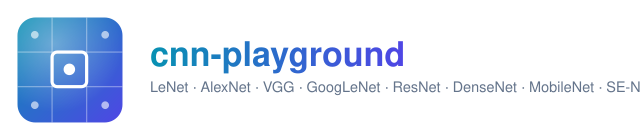

<p align="center">
  
</p>

# cnn-playground

A playground for **CNN architectures**: implement, run, and benchmark
fifteen convolutional architectures spanning the field's core ideas --
plus one deliberate non-convolutional contrast baseline -- side by side on
real image datasets. Third companion project, after
[`liquid-nn-playground`](https://github.com/agpoks/liquid-nn-playground)
and [`sciml-playground`](https://github.com/agpoks/sciml-playground), same
layout and philosophy.

| Idea | Model | Folder |
|---|---|---|
| The original CNN | **LeNet-5** | [`models/lenet`](models/lenet) |
| Deep + ReLU + dropout | **AlexNet** | [`models/alexnet`](models/alexnet) |
| Uniform stacks of small convs | **VGG** | [`models/vgg`](models/vgg) |
| Multi-branch modules | **GoogLeNet/Inception** | [`models/googlenet`](models/googlenet) |
| Skip/identity connections | **ResNet** | [`models/resnet`](models/resnet) |
| Every layer feeds every later layer | **DenseNet** | [`models/densenet`](models/densenet) |
| Depthwise-separable convolutions | **MobileNet** | [`models/mobilenet`](models/mobilenet) |
| Channel attention | **SE-Net** | [`models/senet`](models/senet) |
| Continuous (ODE-integrated) depth | **ODE-Net** | [`models/odenet`](models/odenet) |
| ODE-Net's dynamics, made "liquid" (learned time-constants) | **Liquid-ODE** | [`models/liquidode`](models/liquidode) |
| Structured kernel: Legendre-polynomial edge functions (KAN) | **Legendre-KAN-Conv** | [`models/legendrekan`](models/legendrekan) |
| Structured kernel: Kautz/Laguerre basis (from system ID, not one paper) | **OBF-Conv** | [`models/obfconv`](models/obfconv) |
| Encoder-decoder, per-pixel prediction | **U-Net** | [`models/unet`](models/unet) |
| Local update rule, iterated -- not a classifier at all | **NCA** (Growing Neural Cellular Automata) | [`models/nca`](models/nca) |
| Classification -> detection | **YOLO-style detector** | [`models/yolo`](models/yolo) |
| **No convolution at all** (contrast baseline) | **Vision Transformer (ViT)** | [`models/vit`](models/vit) |

Full paper references and why each one was picked: [`papers/README.md`](papers/README.md).
Docs: see [`docs/`](docs) (built on Read the Docs).

## Layout

```
cnn-playground/
├── models/<name>/    model.py, example.py, example.ipynb, README.md  (one per architecture)
├── cnn_playground/    shared package: device (cpu/gpu/mps) resolution, real dataset loaders
├── datasets/          dataset docs
├── benchmarks/        YAML suites, grouped by which models share a dataset
├── papers/            reference list, BibTeX
└── docs/              Sphinx / Read the Docs source
```

## Install

```bash
git clone https://github.com/agpoks/cnn-playground.git
cd cnn-playground
pip install -e ".[notebooks]"
```

## Run a model

```bash
python models/lenet/example.py --device auto
```

Every example script takes `--device {auto,cpu,cuda,mps}`. Every model also
has a matching `example.ipynb`.

## Real datasets, no accounts

Four real, standard vision datasets -- see [`datasets/README.md`](datasets/README.md).
(NCA is the one exception: it grows a procedurally generated RGBA pattern
from a single seed cell rather than training on a dataset -- see
[`models/nca`](models/nca) for why.)

- **MNIST** (LeCun et al.) -- LeNet's original task.
- **CIFAR-10** (Krizhevsky) -- AlexNet through ViT (including ODE-Net,
  Liquid-ODE, Legendre-KAN-Conv, and OBF-Conv), so they're directly
  comparable on the same classification task.
- **Oxford-IIIT Pet** (pixel-level segmentation masks) -- U-Net.
- **Penn-Fudan pedestrians** (real bounding boxes derived from real
  per-instance masks) -- the YOLO-style detector.

All four auto-download on first use via `torchvision` or one direct,
stable URL -- no accounts, no manual steps.

## Scope note

Like `sciml-playground`, these fifteen models are heterogeneous enough
(classification vs. dense per-pixel segmentation vs. multi-box detection
vs. NCA's iterated growth rule) that benchmarking only makes sense within
a dataset cluster -- see `benchmarks/README.md`.

## License

MIT, see [`LICENSE`](LICENSE).
