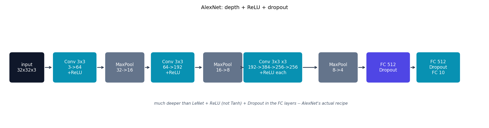

# AlexNet -- depth + ReLU + dropout

AlexNet {cite}`krizhevsky2012alexnet` is much deeper than {doc}`lenet`, uses
ReLU instead of `Tanh`, and adds dropout in the FC layers -- the recipe that
kicked off the deep-learning era of computer vision.

## The architecture

The original network was built for 224x224 ImageNet input with an
aggressive stride-4 first conv; applied directly to CIFAR-10's 32x32
images that would collapse the spatial size almost immediately. This
module keeps the paper's exact per-layer channel progression
(64 -> 192 -> 384 -> 256 -> 256) but re-tunes kernel sizes/strides for
32x32 input (stride-1 3x3 convs, downsampling only at the three max-pools)
-- the same adaptation the ResNet paper itself makes for its own CIFAR-10
experiments:

```
32x32 -> Conv(3->64)    -> ReLU -> MaxPool  : 32x32 -> 16x16
       -> Conv(64->192)  -> ReLU -> MaxPool  : 16x16 -> 8x8
       -> Conv(192->384) -> ReLU
       -> Conv(384->256) -> ReLU
       -> Conv(256->256) -> ReLU -> MaxPool  : 8x8 -> 4x4
Flatten (256*4*4=4096) -> FC(512) -> Dropout -> FC(512) -> Dropout -> FC(10)
```

One further, CPU-speed-motivated simplification beyond the conv/stride
adaptation: the paper's FC stage is 4096-wide (`256*4*4 -> 4096 -> 4096`,
~33M parameters in the classifier alone), which is fine on the GPUs the
paper trains on but is the single biggest cost in this repo's CPU-only
budget -- two 4096x4096 matrix multiplies per batch dominate training time
far more than any of the conv layers above them. This module uses a
512-wide FC stage instead, keeping AlexNet's "deeper + ReLU + dropout"
recipe intact while cutting the classifier's parameter count by roughly
64x -- reproducing the paper's exact 1000-way-ImageNet-sized FC width buys
nothing on a 10-class CIFAR-10 task.

## How it's built

`AlexNet.forward` in
[`models/alexnet/model.py`](https://github.com/agpoks/cnn-playground/blob/main/models/alexnet/model.py):

```python
self.features = nn.Sequential(
    nn.Conv2d(3, 64, kernel_size=3, padding=1), nn.ReLU(inplace=True),
    nn.MaxPool2d(kernel_size=2, stride=2),
    nn.Conv2d(64, 192, kernel_size=3, padding=1), nn.ReLU(inplace=True),
    nn.MaxPool2d(kernel_size=2, stride=2),
    nn.Conv2d(192, 384, kernel_size=3, padding=1), nn.ReLU(inplace=True),
    nn.Conv2d(384, 256, kernel_size=3, padding=1), nn.ReLU(inplace=True),
    nn.Conv2d(256, 256, kernel_size=3, padding=1), nn.ReLU(inplace=True),
    nn.MaxPool2d(kernel_size=2, stride=2),
)
self.classifier = nn.Sequential(
    nn.Dropout(dropout), nn.Linear(256 * 4 * 4, 512), nn.ReLU(inplace=True),
    nn.Dropout(dropout), nn.Linear(512, 512), nn.ReLU(inplace=True),
    nn.Linear(512, num_classes),
)
```

Compare this directly to {doc}`lenet`'s two-conv-stage, `Tanh`-activated
network -- AlexNet is the same "conv, pool, repeat, then classify" shape,
just deeper and with the modern ReLU/dropout choices that made training it
practical.



```{eval-rst}
.. plot::

    from cnn_playground.utils.diagrams import new_ax, box, arrow, INPUT, LINEAR, NONLIN, STATE, OTHER

    fig, ax = new_ax(figsize=(14.5, 3.8), xlim=(0, 22), ylim=(0, 5.5))

    boxes = [
        (1.0, "input\n32x32x3", 1.5, INPUT),
        (3.2, "Conv 3x3\n3->64\n+ReLU", 1.9, LINEAR),
        (5.5, "MaxPool\n32->16", 1.7, OTHER),
        (7.7, "Conv 3x3\n64->192\n+ReLU", 1.9, LINEAR),
        (10.0, "MaxPool\n16->8", 1.7, OTHER),
        (12.3, "Conv 3x3 x3\n192->384->256->256\n+ReLU each", 2.6, LINEAR),
        (15.3, "MaxPool\n8->4", 1.7, OTHER),
        (17.6, "FC 512\nDropout", 1.9, NONLIN),
        (19.9, "FC 512\nDropout\nFC 10", 1.9, LINEAR),
    ]
    cy = 2.75
    prev_x, prev_w = None, None
    for x, text, w, color in boxes:
        box(ax, x, cy, w, 1.4, text, color)
        if prev_x is not None:
            arrow(ax, (prev_x + prev_w / 2 + 0.05, cy), (x - w / 2 - 0.05, cy))
        prev_x, prev_w = x, w

    ax.text(11.3, 0.9,
            "much deeper than LeNet + ReLU (not Tanh) + Dropout in the FC layers -- AlexNet's actual recipe",
            fontsize=8.5, ha="center", color="#475569", style="italic")
    ax.set_title("AlexNet: depth + ReLU + dropout", fontsize=11)
```

## Try it

```bash
python models/alexnet/example.py --device auto     # trains on real CIFAR-10
```

or open [`models/alexnet/example.ipynb`](https://github.com/agpoks/cnn-playground/blob/main/models/alexnet/example.ipynb).
Full runnable code: [`models/alexnet/model.py`](https://github.com/agpoks/cnn-playground/blob/main/models/alexnet/model.py) ·
[`models/alexnet/README.md`](https://github.com/agpoks/cnn-playground/blob/main/models/alexnet/README.md).

## References

```{eval-rst}
.. bibliography::
   :filter: docname in docnames
```
