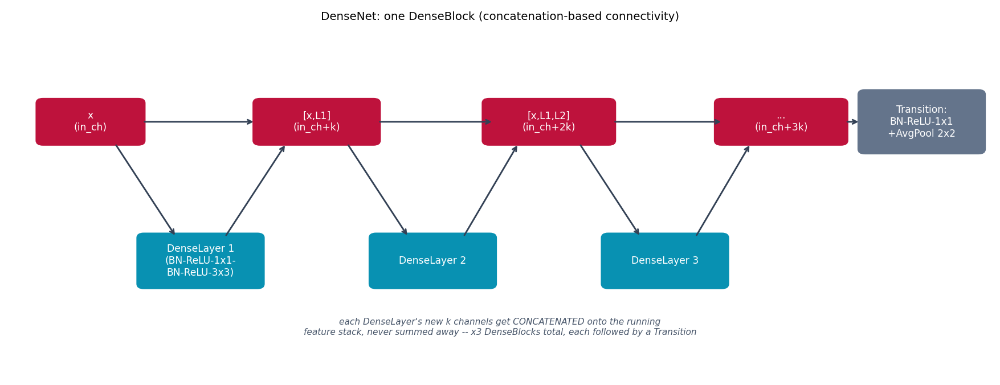

# DenseNet -- every layer feeds every later layer

DenseNet {cite}`huang2017densenet` takes {doc}`resnet`'s skip connection
one step further. ResNet adds a block's input back to its output (a sum).
DenseNet instead **concatenates**: inside a DenseBlock, layer $i$'s input
is the channel-wise concatenation of the block's original input plus
*every earlier layer's output* in that block -- nothing computed anywhere
in the block is ever discarded before the block ends.

## The architecture

Layer $i$ therefore sees $\text{in\_channels} + i \cdot k$ input channels,
where $k$ (the "growth rate") is how many new channels each layer
contributes. This maximizes feature reuse: a later layer can use an early
layer's feature directly instead of the network re-deriving it. A 1x1
bottleneck before each layer's 3x3 conv ("DenseNet-B") keeps that growing
input channel count from making every layer expensive, and a "transition
layer" between DenseBlocks (1x1 conv channel compression + 2x2 avg-pool,
"DenseNet-C") keeps the whole network's channel count under control.

Sized for CIFAR-10/CPU speed: 3 DenseBlocks of 4 layers each, growth
rate 12 -- much shallower than the paper's 100+-layer CIFAR configs, same
block/transition structure.

## How it's built

`DenseBlock.forward` in
[`models/densenet/model.py`](https://github.com/agpoks/cnn-playground/blob/main/models/densenet/model.py)
is exactly this "keep concatenating" loop:

```python
def forward(self, x: torch.Tensor) -> torch.Tensor:
    features = [x]
    for layer in self.layers:
        new_features = layer(torch.cat(features, dim=1))
        features.append(new_features)
    return torch.cat(features, dim=1)
```

Each `_DenseLayer` is `[BN -> ReLU -> 1x1 Conv (bottleneck) -> BN -> ReLU
-> 3x3 Conv (-> growth_rate channels)]`. `DenseNetModel` stacks three of
these blocks, each followed by a `TransitionLayer`, then a global-average
pool and one FC classifier.



```{eval-rst}
.. plot::

    from cnn_playground.utils.diagrams import new_ax, box, arrow, LINEAR, STATE, OTHER

    fig, ax = new_ax(figsize=(13.5, 5.2), xlim=(0, 16), ylim=(0, 8))

    acc0 = box(ax, 1.3, 5.8, 1.7, 1.0, "x\n(in_ch)", STATE)
    L1 = box(ax, 3.1, 2.6, 2.0, 1.2, "DenseLayer 1\n(BN-ReLU-1x1-\nBN-ReLU-3x3)", LINEAR)
    acc1 = box(ax, 5.0, 5.8, 2.0, 1.0, "[x,L1]\n(in_ch+k)", STATE)
    L2 = box(ax, 6.9, 2.6, 2.0, 1.2, "DenseLayer 2", LINEAR)
    acc2 = box(ax, 8.8, 5.8, 2.1, 1.0, "[x,L1,L2]\n(in_ch+2k)", STATE)
    L3 = box(ax, 10.7, 2.6, 2.0, 1.2, "DenseLayer 3", LINEAR)
    acc3 = box(ax, 12.6, 5.8, 2.1, 1.0, "...\n(in_ch+3k)", STATE)
    trans = box(ax, 14.9, 5.8, 2.0, 1.4, "Transition:\nBN-ReLU-1x1\n+AvgPool 2x2", OTHER)

    arrow(ax, (2.15, 5.8), (4.0, 5.8))
    arrow(ax, (1.7, 5.3), (2.7, 3.15))
    arrow(ax, (3.5, 3.15), (4.5, 5.3))
    arrow(ax, (6.0, 5.8), (7.9, 5.8))
    arrow(ax, (5.5, 5.3), (6.5, 3.15))
    arrow(ax, (7.4, 3.15), (8.3, 5.3))
    arrow(ax, (9.85, 5.8), (11.65, 5.8))
    arrow(ax, (9.3, 5.3), (10.3, 3.15))
    arrow(ax, (11.2, 3.15), (12.1, 5.3))
    arrow(ax, (13.65, 5.8), (13.9, 5.8))

    ax.text(8.0, 0.9,
            "each DenseLayer's new k channels get CONCATENATED onto the running\n"
            "feature stack, never summed away -- x3 DenseBlocks total, each followed by a Transition",
            fontsize=8.5, ha="center", color="#475569", style="italic")

    ax.set_title("DenseNet: one DenseBlock (concatenation-based connectivity)", fontsize=11)
```

## Try it

```bash
python models/densenet/example.py --device auto     # trains on real CIFAR-10
```

or open [`models/densenet/example.ipynb`](https://github.com/agpoks/cnn-playground/blob/main/models/densenet/example.ipynb).
Full runnable code: [`models/densenet/model.py`](https://github.com/agpoks/cnn-playground/blob/main/models/densenet/model.py) ·
[`models/densenet/README.md`](https://github.com/agpoks/cnn-playground/blob/main/models/densenet/README.md).

## References

```{eval-rst}
.. bibliography::
   :filter: docname in docnames
```
