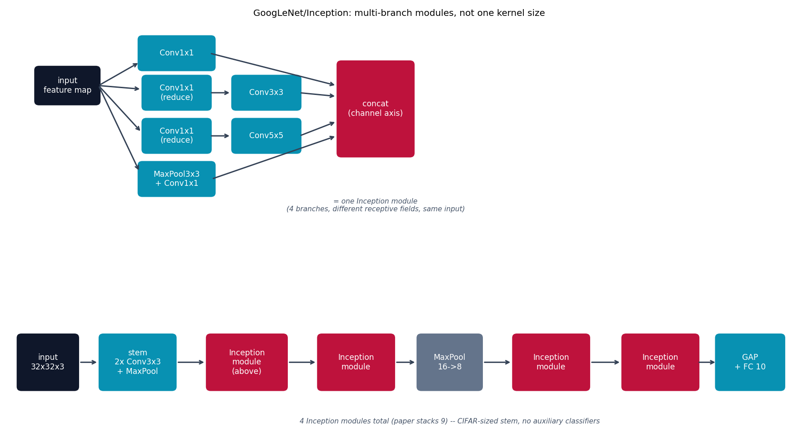

# GoogLeNet/Inception -- multi-branch modules, not one kernel size

Every model up to here commits one kernel size per layer. GoogLeNet
{cite}`szegedy2015googlenet`'s Inception module instead runs several
branches with **different** receptive fields over the **same** input in
parallel, then concatenates their outputs along the channel axis -- the
network blends fine (1x1), medium (3x3), and coarse (5x5) detail at every
stage instead of having to pick one.

## The architecture

This implements the paper's "dimension-reduced" module (Fig. 2b), not the
naive one (Fig. 2a): a 1x1 conv "bottleneck" is inserted before the 3x3
and 5x5 branches purely to cut their input channel count first -- without
it, the 5x5 branch's compute cost would grow with the (large, unreduced)
number of input channels, which is what made the naive version
impractical.

**CIFAR-10 adaptation:** the paper's 224x224-input stem (7x7 stride-2 conv
+ pool, then a 3x3 stride-1 conv + pool) discards 16x of resolution before
a single Inception module runs -- fine at 224x224, but it would leave
almost nothing at 32x32. This version uses a much gentler stem (two 3x3
stride-1 convs + one 2x2 pool) and only 4 Inception modules total (the
paper stacks 9), with global average pooling and one FC layer at the end.
The paper's auxiliary classifiers (two extra loss heads part-way through
the network, added to help gradients reach the earlier layers of its full
22-layer depth) are skipped entirely -- unnecessary at this much shallower
depth.

## How it's built

`InceptionModule.forward` in
[`models/googlenet/model.py`](https://github.com/agpoks/cnn-playground/blob/main/models/googlenet/model.py)
runs the four branches and concatenates:

```python
self.branch1 = nn.Sequential(nn.Conv2d(in_channels, out_1x1, kernel_size=1), nn.ReLU(inplace=True))
self.branch2 = nn.Sequential(
    nn.Conv2d(in_channels, reduce_3x3, kernel_size=1), nn.ReLU(inplace=True),
    nn.Conv2d(reduce_3x3, out_3x3, kernel_size=3, padding=1), nn.ReLU(inplace=True),
)
self.branch3 = nn.Sequential(
    nn.Conv2d(in_channels, reduce_5x5, kernel_size=1), nn.ReLU(inplace=True),
    nn.Conv2d(reduce_5x5, out_5x5, kernel_size=5, padding=2), nn.ReLU(inplace=True),
)
self.branch4 = nn.Sequential(
    nn.MaxPool2d(kernel_size=3, stride=1, padding=1),
    nn.Conv2d(in_channels, out_pool, kernel_size=1), nn.ReLU(inplace=True),
)

def forward(self, x):
    return torch.cat([self.branch1(x), self.branch2(x), self.branch3(x), self.branch4(x)], dim=1)
```

`GoogLeNetModel` then chains 4 of these modules after a small stem, with
one plain `MaxPool2d` between the second and third module for
downsampling, ending in global average pooling and one `Linear` classifier
-- see {doc}`../model_comparison` for how this compares to {doc}`resnet`'s
very different way of going deep (skip connections, not parallel branches).



```{eval-rst}
.. plot::

    from cnn_playground.utils.diagrams import new_ax, box, arrow, INPUT, LINEAR, NONLIN, STATE, OTHER

    fig, ax = new_ax(figsize=(13.5, 7.5), xlim=(0, 20), ylim=(0, 11.5))

    box(ax, 1.5, 9.7, 1.6, 1.0, "input\nfeature map", INPUT)
    box(ax, 4.3, 10.6, 1.9, 0.9, "Conv1x1", LINEAR)
    box(ax, 4.3, 9.5, 1.7, 0.9, "Conv1x1\n(reduce)", LINEAR)
    box(ax, 6.6, 9.5, 1.7, 0.9, "Conv3x3", LINEAR)
    box(ax, 4.3, 8.3, 1.7, 0.9, "Conv1x1\n(reduce)", LINEAR)
    box(ax, 6.6, 8.3, 1.7, 0.9, "Conv5x5", LINEAR)
    box(ax, 4.3, 7.1, 1.9, 0.9, "MaxPool3x3\n+ Conv1x1", LINEAR)
    box(ax, 9.4, 9.05, 1.9, 2.6, "concat\n(channel axis)", STATE)

    arrow(ax, (2.3, 9.7), (3.35, 10.35))
    arrow(ax, (2.3, 9.7), (3.4, 9.6))
    arrow(ax, (2.3, 9.7), (3.4, 8.4))
    arrow(ax, (2.3, 9.7), (3.35, 7.3))
    arrow(ax, (5.15, 10.6), (8.4, 9.7))
    arrow(ax, (5.15, 9.5), (5.7, 9.5))
    arrow(ax, (7.45, 9.5), (8.4, 9.4))
    arrow(ax, (5.15, 8.3), (5.7, 8.3))
    arrow(ax, (7.45, 8.3), (8.4, 8.7))
    arrow(ax, (5.2, 7.1), (8.4, 8.3))

    ax.text(9.4, 6.2, "= one Inception module\n(4 branches, different receptive fields, same input)",
            fontsize=8.5, ha="center", color="#475569", style="italic")

    cy = 2.0
    boxes = [
        (1.0, "input\n32x32x3", 1.5, INPUT),
        (3.3, "stem\n2x Conv3x3\n+ MaxPool", 1.9, LINEAR),
        (6.1, "Inception\nmodule\n(above)", 2.0, STATE),
        (8.9, "Inception\nmodule", 1.9, STATE),
        (11.3, "MaxPool\n16->8", 1.6, OTHER),
        (13.9, "Inception\nmodule", 1.9, STATE),
        (16.7, "Inception\nmodule", 1.9, STATE),
    ]
    prev_x, prev_w = None, None
    for x, text, w, color in boxes:
        box(ax, x, cy, w, 1.5, text, color)
        if prev_x is not None:
            arrow(ax, (prev_x + prev_w / 2 + 0.05, cy), (x - w / 2 - 0.05, cy))
        prev_x, prev_w = x, w

    box(ax, 19.0, 2.0, 1.7, 1.5, "GAP\n+ FC 10", LINEAR)
    arrow(ax, (17.65, 2.0), (18.15, 2.0))

    ax.text(11.3, 0.3, "4 Inception modules total (paper stacks 9) -- CIFAR-sized stem, no auxiliary classifiers",
            fontsize=8.5, ha="center", color="#475569", style="italic")
    ax.set_title("GoogLeNet/Inception: multi-branch modules, not one kernel size", fontsize=11)
```

## Try it

```bash
python models/googlenet/example.py --device auto     # trains on real CIFAR-10
```

or open [`models/googlenet/example.ipynb`](https://github.com/agpoks/cnn-playground/blob/main/models/googlenet/example.ipynb).
Full runnable code: [`models/googlenet/model.py`](https://github.com/agpoks/cnn-playground/blob/main/models/googlenet/model.py) ·
[`models/googlenet/README.md`](https://github.com/agpoks/cnn-playground/blob/main/models/googlenet/README.md).

## References

```{eval-rst}
.. bibliography::
   :filter: docname in docnames
```
