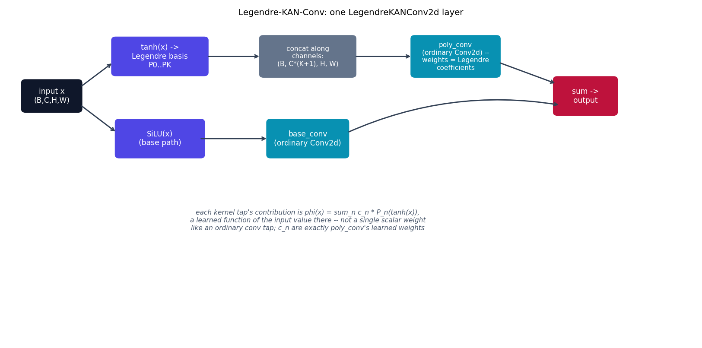

# Legendre-KAN-Conv -- a Legendre-polynomial kernel basis

Legendre-KAN-Conv combines two real, cited ideas -- Kolmogorov-Arnold
Networks {cite}`liu2024kan` and Convolutional Kolmogorov-Arnold Networks
{cite}`bodner2024convkan` -- with a Legendre-polynomial basis choice that
follows a general community implementation pattern rather than one
single dedicated paper (see the honesty note below). Every other model in
this repo learns one free scalar weight per kernel tap; here, each tap's
contribution is a *learned function* of the input value at that tap,
expanded in a truncated Legendre-polynomial basis.

## The equation

Ordinary KAN replaces `y = Wx + b` with `y_j = sum_i phi_{ij}(x_i)`, where
each `phi_{ij}` is a learnable univariate function (originally a
B-spline). This repo's convolutional variant parameterizes `phi` as a
degree-K Legendre expansion of the ("tanh"-squashed) input value at each
kernel tap:

$$
\phi(x) = \sum_{n=0}^{K} c_n\, P_n(\tanh(x))
$$

where $P_n$ are Legendre polynomials, generated by the standard
three-term recurrence

$$
P_0(x) = 1, \qquad P_1(x) = x, \qquad
(n+1) P_{n+1}(x) = (2n+1)\, x\, P_n(x) - n\, P_{n-1}(x)
$$

and $c_n$ are the learned coefficients -- realized as ordinary conv
weights, once the $K{+}1$ polynomial transforms are stacked along the
channel dimension (see below). A parallel `SiLU(x)`-then-`Conv2d` "base"
path is added on top, mirroring the original KAN paper's base-function +
learned-spline residual design.

## How it's built

`legendre_basis` and `LegendreKANConv2d` in
[`models/legendrekan/model.py`](https://github.com/agpoks/cnn-playground/blob/main/models/legendrekan/model.py):

```python
def legendre_basis(x, degree):
    polys = [torch.ones_like(x), x]
    for n in range(1, degree):
        p_next = ((2 * n + 1) * x * polys[n] - n * polys[n - 1]) / (n + 1)
        polys.append(p_next)
    return torch.cat(polys[: degree + 1], dim=1)


class LegendreKANConv2d(nn.Module):
    def forward(self, x):
        x_squashed = torch.tanh(x)
        basis = legendre_basis(x_squashed, self.degree)
        return self.poly_conv(basis) + self.base_conv(F.silu(x))
```

The key trick (also used by real ConvKAN implementations, for efficiency):
rather than allocating a separate weight per (kernel tap, polynomial
degree) pair, the $K{+}1$ Legendre transforms of the squashed input are
concatenated along the channel dimension, and **one ordinary `Conv2d`**
consumes the expanded tensor. That conv's learned weights *are* the
per-edge Legendre coefficients -- mathematically identical to a literal
"one polynomial-weight vector per tap" formulation, expressed as a single
matmul instead of $K{+}1$ small ones.

`LegendreKANModel` stacks three `LegendreKANConv2d` blocks (each followed
by `BatchNorm` + `ReLU`), with an ordinary strided conv for downsampling
between the first two, then global average pool and a linear classifier
for CIFAR-10.

**Simplifications / honesty note**, stated explicitly: (1) there is no
single canonical paper for "Legendre-basis ConvKAN" specifically --
Bodner et al. establish the general ConvKAN pattern using B-splines;
Legendre (and Chebyshev, Fourier, wavelet) variants exist mainly as
community implementations (e.g. the `torch-conv-kan` GitHub project's
`ResKANet`, which reports 84.17% on CIFAR-10 with Legendre convolutions)
rather than one dedicated paper -- this page's mechanism follows that
general pattern, not a specific paper's exact architecture. (2) The
"expand basis into channels, then one ordinary conv" implementation is
mathematically equivalent to a literal per-tap-per-degree weight
allocation, just computed as one matmul for efficiency. (3) The base+SiLU
residual path is one specific, documented choice among several the KAN
literature uses for the "base function" term.



```{eval-rst}
.. plot::

    from cnn_playground.utils.diagrams import new_ax, box, arrow, INPUT, LINEAR, NONLIN, STATE, OTHER

    fig, ax = new_ax(figsize=(12.5, 6.2), xlim=(0, 19), ylim=(0, 10.5))

    box(ax, 1.2, 8.0, 1.6, 1.0, "input x\n(B,C,H,W)", INPUT)
    box(ax, 4.2, 9.3, 2.6, 1.2, "tanh(x) ->\nLegendre basis\nP0..PK", NONLIN)
    box(ax, 4.2, 6.6, 2.4, 1.2, "SiLU(x)\n(base path)", NONLIN)

    box(ax, 8.3, 9.3, 2.6, 1.3, "concat along\nchannels:\n(B, C*(K+1), H, W)", OTHER, fontsize=8.5)
    box(ax, 8.3, 6.6, 2.2, 1.2, "base_conv\n(ordinary Conv2d)", LINEAR)

    box(ax, 12.4, 9.3, 2.4, 1.3, "poly_conv\n(ordinary Conv2d) --\nweights = Legendre\ncoefficients", LINEAR, fontsize=8.5)

    box(ax, 16.0, 8.0, 1.7, 1.2, "sum ->\noutput", STATE)

    arrow(ax, (2.0, 8.3), (2.9, 9.1))
    arrow(ax, (2.0, 7.7), (3.0, 6.8))
    arrow(ax, (5.5, 9.3), (7.0, 9.3))
    arrow(ax, (9.6, 9.3), (11.2, 9.3))
    arrow(ax, (13.6, 9.1), (15.2, 8.4))
    arrow(ax, (5.3, 6.6), (7.2, 6.6))
    arrow(ax, (9.4, 6.8), (15.3, 7.7), curve=-0.15)

    ax.text(8.3, 3.6,
            "each kernel tap's contribution is phi(x) = sum_n c_n * P_n(tanh(x)),\n"
            "a learned function of the input value there -- not a single scalar weight\n"
            "like an ordinary conv tap; c_n are exactly poly_conv's learned weights",
            fontsize=8.5, ha="center", color="#475569", style="italic")

    ax.set_title("Legendre-KAN-Conv: one LegendreKANConv2d layer", fontsize=11)
```

See {doc}`../model_comparison` for how this fits alongside the
ResNet -> ODE-Net -> Liquid-ODE progression and the wider
"structured-kernel-basis" literature (Structured Receptive Fields, Gabor
CNNs, Spherical CNNs) it echoes without reproducing.

## Try it

```bash
python models/legendrekan/example.py --device auto     # trains on real CIFAR-10
```

or open [`models/legendrekan/example.ipynb`](https://github.com/agpoks/cnn-playground/blob/main/models/legendrekan/example.ipynb).
Full runnable code: [`models/legendrekan/model.py`](https://github.com/agpoks/cnn-playground/blob/main/models/legendrekan/model.py) ·
[`models/legendrekan/README.md`](https://github.com/agpoks/cnn-playground/blob/main/models/legendrekan/README.md).

## References

```{eval-rst}
.. bibliography::
   :filter: docname in docnames
```
