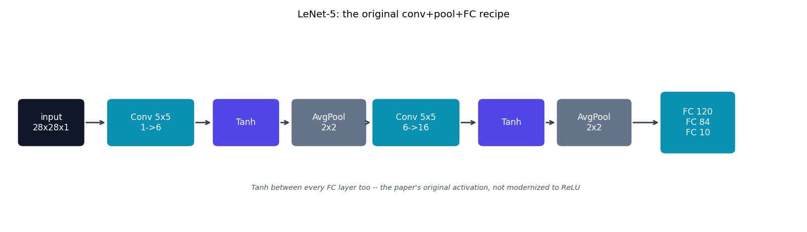

# LeNet-5 -- the original CNN

LeNet-5 {cite}`lecun1998lenet` is the model every other one in this repo
builds on: two conv+pool stages, then three fully-connected layers. It is
deliberately **not** modernized here -- it uses the paper's actual choices,
`Tanh` activations and `AvgPool` (not ReLU/`MaxPool`), so it reads as the
historical starting point rather than a ReLU-ified reinterpretation.

## The architecture

Applied to real 28x28 MNIST (the paper used 32x32 padded input; `padding=2`
on the first conv reproduces the same feature-map sizes throughout,
a standard adaptation, not a change to the architecture):

```
Conv(1->6, 5x5, pad=2) -> Tanh -> AvgPool(2x2)   :  28x28 -> 14x14
Conv(6->16, 5x5)       -> Tanh -> AvgPool(2x2)   :  14x14 -> 5x5
Flatten -> FC(16*5*5->120) -> Tanh -> FC(120->84) -> Tanh -> FC(84->10)
```

## How it's built

`LeNet5.forward` in
[`models/lenet/model.py`](https://github.com/agpoks/cnn-playground/blob/main/models/lenet/model.py)
is exactly that sequence, nothing hidden:

```python
self.features = nn.Sequential(
    nn.Conv2d(1, 6, kernel_size=5, padding=2),
    nn.Tanh(),
    nn.AvgPool2d(kernel_size=2, stride=2),
    nn.Conv2d(6, 16, kernel_size=5),
    nn.Tanh(),
    nn.AvgPool2d(kernel_size=2, stride=2),
)
self.classifier = nn.Sequential(
    nn.Linear(16 * 5 * 5, 120), nn.Tanh(),
    nn.Linear(120, 84), nn.Tanh(),
    nn.Linear(84, num_classes),
)
```

Every later model in this repo (AlexNet, VGG, ...) changes exactly one
thing about this recipe at a time -- see {doc}`../model_comparison` for the
full ladder.



```{eval-rst}
.. plot::

    from cnn_playground.utils.diagrams import new_ax, box, arrow, INPUT, LINEAR, NONLIN, STATE, OTHER

    fig, ax = new_ax(figsize=(12.5, 3.6), xlim=(0, 19), ylim=(0, 5.5))

    box(ax, 1.0, 2.75, 1.5, 1.2, "input\n28x28x1", INPUT)
    box(ax, 3.4, 2.75, 2.0, 1.2, "Conv 5x5\n1->6", LINEAR)
    box(ax, 5.7, 2.75, 1.5, 1.2, "Tanh", NONLIN)
    box(ax, 7.7, 2.75, 1.7, 1.2, "AvgPool\n2x2", OTHER)
    box(ax, 9.8, 2.75, 2.0, 1.2, "Conv 5x5\n6->16", LINEAR)
    box(ax, 12.1, 2.75, 1.5, 1.2, "Tanh", NONLIN)
    box(ax, 14.1, 2.75, 1.7, 1.2, "AvgPool\n2x2", OTHER)
    box(ax, 16.6, 2.75, 1.7, 1.6, "FC 120\nFC 84\nFC 10", LINEAR)

    xs = [1.0, 3.4, 5.7, 7.7, 9.8, 12.1, 14.1, 16.6]
    ws = [1.5, 2.0, 1.5, 1.7, 2.0, 1.5, 1.7, 1.7]
    for i in range(len(xs) - 1):
        arrow(ax, (xs[i] + ws[i] / 2 + 0.05, 2.75), (xs[i + 1] - ws[i + 1] / 2 - 0.05, 2.75))

    ax.text(9.8, 0.9, "Tanh between every FC layer too -- the paper's original activation, not modernized to ReLU",
            fontsize=8, ha="center", color="#475569", style="italic")
    ax.set_title("LeNet-5: the original conv+pool+FC recipe", fontsize=11)
```

## Try it

```bash
python models/lenet/example.py --device auto     # trains on real MNIST
```

or open [`models/lenet/example.ipynb`](https://github.com/agpoks/cnn-playground/blob/main/models/lenet/example.ipynb).
Full runnable code: [`models/lenet/model.py`](https://github.com/agpoks/cnn-playground/blob/main/models/lenet/model.py) ·
[`models/lenet/README.md`](https://github.com/agpoks/cnn-playground/blob/main/models/lenet/README.md).

## References

```{eval-rst}
.. bibliography::
   :filter: docname in docnames
```
