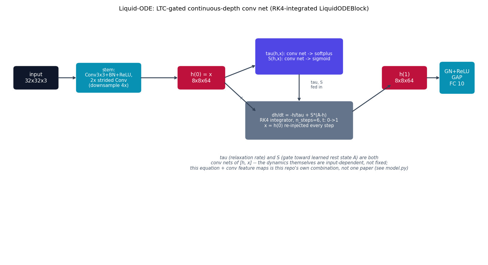

# Liquid-ODE -- an ODE-Net with liquid, gated dynamics

**Not a single published paper.** This model is this repo's own assembly
of two separate, real ideas: {doc}`odenet`'s continuous-depth formulation
({cite}`chen2018odenet`) and Liquid Time-Constant Networks' governing
equation ({cite}`hasani2021ltc`). As far as could be found by searching
the literature, LTC/CfC papers apply their gated equation to a small state
vector evolving over time (sequential, robotics, time-series data) --
applying that same equation to a *conv feature map* as the ODE state, in
place of ODE-Net's plain `f(h,t)`, has not been found combined this way
before. Say this plainly: don't read this page as reproducing a paper --
read it as "what happens if you take ODE-Net and make its dynamics liquid."

## The equation

{doc}`odenet` integrates `dh/dt = f(h,t)` where `f` is a plain conv net.
Liquid-ODE instead integrates the Liquid Time-Constant equation:

$$
\frac{dh}{dt} = -\frac{h}{\tau(h, x)} + S(h, x) \odot \bigl(A - h\bigr)
$$

where $\tau(h,x)$ (a per-channel *time constant* -- how fast $h$ relaxes)
and $S(h,x)$ (a *gate*, in $[0,1]$) are each small conv nets of the current
state $h$ and an input $x$, and $A$ is a learned per-channel rest state.
Unlike ODE-Net's fixed $f$, both the relaxation rate and the state $h$ is
pulled toward are themselves functions of the input -- this input-dependent
relaxation is what "liquid" means in the original LTC paper. Integrated by
the same hand-rolled fixed-step RK4 scheme as {doc}`odenet`:

$$
\begin{aligned}
k_1 &= g(h, x) \\
k_2 &= g(h + \tfrac{1}{2}\Delta t\, k_1,\ x) \\
k_3 &= g(h + \tfrac{1}{2}\Delta t\, k_2,\ x) \\
k_4 &= g(h + \Delta t\, k_3,\ x) \\
h &\leftarrow h + \frac{\Delta t}{6}(k_1 + 2k_2 + 2k_3 + k_4)
\end{aligned}
$$

with $g(h,x) = -h/\tau(h,x) + S(h,x)\odot(A-h)$, repeated `n_steps` times
($\Delta t = 1/\text{n\_steps}$). $x$ is held fixed at $h(0)$ across all
steps (see "Simplifications" below).

## How it's built

`LiquidODEFunc.forward` in
[`models/liquidode/model.py`](https://github.com/agpoks/cnn-playground/blob/main/models/liquidode/model.py)
is exactly the LTC equation above:

```python
def forward(self, h, x):
    hx = torch.cat([h, x], dim=1)
    tau = F.softplus(self.tau_net(hx)) + 0.1
    gate = torch.sigmoid(self.gate_net(hx))
    return -h / tau + gate * (self.A - h)
```

`tau_net` and `gate_net` are each a small `Conv3x3 -> GroupNorm -> ReLU ->
Conv1x1` stack (softplus/sigmoid applied outside, to keep `tau` positive
and `gate` in $[0,1]$). `LiquidODEBlock.forward` is the same RK4 recurrence
`ODEBlock` uses, except every stage calls `ode_func(h, h0)` instead of
`ode_func(h, t)` -- `x = h0` is re-injected at each stage instead of a
scalar time value. `LiquidODENetModel` has the *identical* stem and
classifier head as {doc}`odenet`'s `ODENetModel`; the only structural
difference between the two models is `ODEBlock` vs. `LiquidODEBlock`.

**Simplifications / honesty note**, stated explicitly:

1. Same RK4-instead-of-adjoint simplification as {doc}`odenet` (fixed
   `n_steps=6`, plain autograd through the unrolled solver, no
   `torchdiffeq` or any ODE-solver library).
2. **This is an assembled combination, not a single paper's architecture**
   (see the intro above) -- treat every claim on this page as "this repo's
   design," not "the original authors' design."
3. The LTC equation's external input $x$ would ordinarily be a genuine
   per-timestep signal (e.g. sensor readings arriving at each step of a
   sequence). This conv block has no such signal -- it processes one
   static image, not a sequence -- so $h(0)$ (the stem's output) is
   re-injected as $x$ at every RK4 stage instead, making the dynamics
   "self-input-driven" rather than externally driven.
4. $A$, the rest state the gate pulls $h$ toward, is a learned per-channel
   parameter rather than itself a function of anything -- the simplest
   faithful reading of the paper's constant bias term.



```{eval-rst}
.. plot::

    from cnn_playground.utils.diagrams import new_ax, box, arrow, INPUT, LINEAR, NONLIN, STATE, OTHER

    fig, ax = new_ax(figsize=(12.5, 6.8), xlim=(0, 19), ylim=(0, 11.5))

    box(ax, 1.2, 8.5, 1.7, 1.0, "input\n32x32x3", INPUT)
    box(ax, 4.1, 8.5, 2.5, 1.3, "stem:\nConv3x3+BN+ReLU,\n2x strided Conv\n(downsample 4x)", LINEAR, fontsize=8.5)
    box(ax, 7.8, 8.5, 1.8, 1.0, "h(0) = x\n8x8x64", STATE)

    box(ax, 11.7, 9.5, 3.4, 1.6, "tau(h,x): conv net -> softplus\nS(h,x): conv net -> sigmoid", NONLIN, fontsize=8.3)
    box(ax, 11.7, 6.5, 4.2, 1.7, "dh/dt = -h/tau + S*(A-h)\nRK4 integrator, n_steps=6, t: 0->1\nx = h(0) re-injected every step", OTHER, fontsize=8.3)

    box(ax, 15.9, 8.5, 1.7, 1.0, "h(1)\n8x8x64", STATE)
    box(ax, 18.0, 8.5, 1.3, 1.4, "GN+ReLU\nGAP\nFC 10", LINEAR)

    arrow(ax, (2.05, 8.5), (2.85, 8.5))
    arrow(ax, (5.35, 8.5), (6.9, 8.5))
    arrow(ax, (8.7, 8.5), (10.0, 9.1))
    arrow(ax, (8.7, 8.3), (10.0, 6.9))
    ax.text(9.4, 7.5, "x", fontsize=8, ha="center", color="#475569", style="italic")
    arrow(ax, (11.7, 8.7), (11.7, 7.35))
    ax.text(12.4, 8.0, "tau, S\nfed in", fontsize=7.5, ha="center", color="#475569")
    arrow(ax, (13.8, 6.9), (15.4, 8.2))
    arrow(ax, (16.75, 8.5), (17.35, 8.5))

    ax.text(11.7, 4.2,
            "tau (relaxation rate) and S (gate toward learned rest state A) are both\n"
            "conv nets of [h, x] -- the dynamics themselves are input-dependent, not fixed;\n"
            "this equation + conv feature maps is this repo's own combination, not one paper (see model.py)",
            fontsize=8.3, ha="center", color="#475569", style="italic")

    ax.set_title("Liquid-ODE: LTC-gated continuous-depth conv net (RK4-integrated LiquidODEBlock)", fontsize=11)
```

Same real CIFAR-10 task, stem, and classifier head as {doc}`odenet` (and
the same `n_steps`), so `test_acc`/params/train-time are directly
comparable across ResNet -> ODE-Net -> Liquid-ODE -- see
{doc}`../model_comparison`.

## Try it

```bash
python models/liquidode/example.py --device auto     # trains on real CIFAR-10
```

or open [`models/liquidode/example.ipynb`](https://github.com/agpoks/cnn-playground/blob/main/models/liquidode/example.ipynb).
Full runnable code: [`models/liquidode/model.py`](https://github.com/agpoks/cnn-playground/blob/main/models/liquidode/model.py) ·
[`models/liquidode/README.md`](https://github.com/agpoks/cnn-playground/blob/main/models/liquidode/README.md).

## References

```{eval-rst}
.. bibliography::
   :filter: docname in docnames
```
