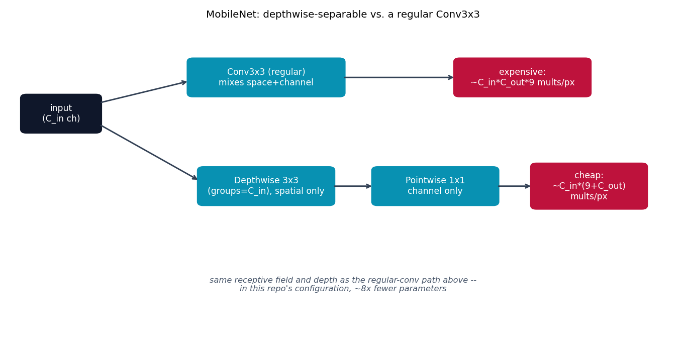

# MobileNet -- depthwise-separable convolutions

MobileNet {cite}`howard2017mobilenet` adds an efficiency axis orthogonal to
everything else in this repo: instead of going deeper or adding
connections, it makes each conv layer itself cheaper.

## The architecture

A regular `Conv3x3(in -> out)` mixes spatial information (the 3x3
neighborhood) *and* cross-channel information (in -> out) in one operation,
costing roughly `in * out * 9` multiply-adds per output pixel. MobileNet
factors that into two much cheaper ops in sequence: a **depthwise** conv (a
3x3 conv with `groups=in_channels` -- one filter per input channel, spatial
mixing only, `in * 9` multiply-adds) followed by a **pointwise** conv (a
1x1 conv, channel mixing only, `in * out` multiply-adds). Total cost
`~in * (9 + out)` instead of `~in * out * 9` -- close to an order of
magnitude fewer multiply-adds for a similar receptive field.

## How it's built

```python
class DepthwiseSeparableConv(nn.Module):
    def __init__(self, in_channels, out_channels, stride=1):
        super().__init__()
        self.depthwise = nn.Conv2d(in_channels, in_channels, 3, stride=stride,
                                    padding=1, groups=in_channels, bias=False)
        self.bn1 = nn.BatchNorm2d(in_channels)
        self.pointwise = nn.Conv2d(in_channels, out_channels, 1, bias=False)
        self.bn2 = nn.BatchNorm2d(out_channels)
```

[`models/mobilenet/model.py`](https://github.com/agpoks/cnn-playground/blob/main/models/mobilenet/model.py)
also builds `PlainConvComparisonModel` -- the identical depth/channel
schedule, but with regular `Conv3x3` layers instead -- purely so
`example.py` can print an honest side-by-side parameter count rather than
just asserting the efficiency claim. In this repo's configuration, the
depthwise-separable version has **about 8x fewer parameters**.



```{eval-rst}
.. plot::

    from cnn_playground.utils.diagrams import new_ax, box, arrow, INPUT, LINEAR, STATE

    fig, ax = new_ax(figsize=(10.5, 5.5), xlim=(0, 13), ylim=(0, 9))

    box(ax, 1.0, 6.5, 1.5, 1.0, "input\n(C_in ch)", INPUT)
    box(ax, 5.0, 7.5, 3.0, 1.0, "Conv3x3 (regular)\nmixes space+channel", LINEAR)
    box(ax, 10.0, 7.5, 2.6, 1.0, "expensive:\n~C_in*C_out*9 mults/px", STATE)

    box(ax, 5.0, 4.5, 2.6, 1.0, "Depthwise 3x3\n(groups=C_in), spatial only", LINEAR)
    box(ax, 8.3, 4.5, 2.4, 1.0, "Pointwise 1x1\nchannel only", LINEAR)
    box(ax, 11.3, 4.5, 2.2, 1.2, "cheap:\n~C_in*(9+C_out)\nmults/px", STATE)

    arrow(ax, (1.75, 6.8), (3.5, 7.4))
    arrow(ax, (6.5, 7.5), (8.7, 7.5))
    arrow(ax, (1.75, 6.2), (3.7, 4.65))
    arrow(ax, (6.3, 4.5), (7.1, 4.5))
    arrow(ax, (9.5, 4.5), (10.2, 4.5))

    ax.text(6.5, 1.6,
            "same receptive field and depth as the regular-conv path above --\n"
            "in this repo's configuration, ~8x fewer parameters",
            fontsize=9, ha="center", color="#475569", style="italic")

    ax.set_title("MobileNet: depthwise-separable vs. a regular Conv3x3", fontsize=11)
```

## Try it

```bash
python models/mobilenet/example.py --device auto     # trains on real CIFAR-10, prints the param-count comparison first
```

or open [`models/mobilenet/example.ipynb`](https://github.com/agpoks/cnn-playground/blob/main/models/mobilenet/example.ipynb).
Full runnable code: [`models/mobilenet/model.py`](https://github.com/agpoks/cnn-playground/blob/main/models/mobilenet/model.py) ·
[`models/mobilenet/README.md`](https://github.com/agpoks/cnn-playground/blob/main/models/mobilenet/README.md).

## References

```{eval-rst}
.. bibliography::
   :filter: docname in docnames
```
