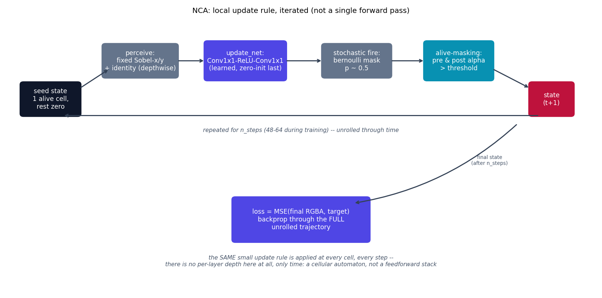
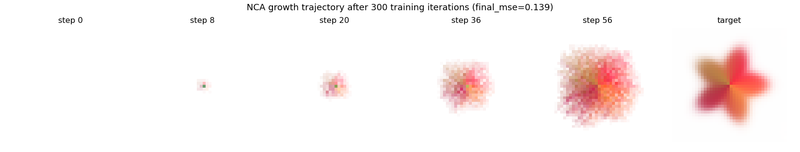

# NCA -- Growing Neural Cellular Automata

NCA {cite}`mordvintsev2020nca` is a different kind of object from every
other model in this repo: instead of one forward pass mapping an image to
a prediction, the trained object is a *local update rule*, applied
identically and independently at every cell of a grid, for many
stochastic asynchronous steps. A single alive seed cell, iterated under
this rule, self-organizes into a target pattern -- closer in spirit to a
cellular automaton or a PDE time-stepper (see `sciml-playground`) than to
a classifier.

## The equation

Each cell perceives its 3x3 neighborhood through **fixed** (non-learned)
depthwise convolutions -- identity, Sobel-x, Sobel-y -- giving a
perception vector $p_i$ per cell. A small learned network maps that to an
update:

$$
\Delta v_i = g_\theta(p_i)
$$

applied stochastically (a random subset of cells "fire" each step, with
probability `fire_rate`, so the rule works without a global clock) and
masked by aliveness (a cell survives only if both its pre- and
post-update 3x3-max-pooled alpha exceed a threshold):

$$
v_i^{(t+1)} = \mathrm{alive}_i^{(t)} \cdot \mathrm{alive}_i^{(t+1)} \cdot \bigl(v_i^{(t)} + m_i \odot \Delta v_i\bigr), \qquad m_i \sim \mathrm{Bernoulli}(\text{fire\_rate})
$$

Training unrolls this update for a random number of steps (48-64 here)
from a single seed cell, and minimizes the MSE between the final RGBA
channels and a target image -- backpropagating through the *entire*
unrolled trajectory.

## How it's built

`NCAModel.step` in
[`models/nca/model.py`](https://github.com/agpoks/cnn-playground/blob/main/models/nca/model.py)
is exactly the update above:

```python
def step(self, state):
    pre_alive = self.alive_mask(state)
    perception = self.perceive(state)
    delta = self.update_net(perception)
    fire_mask = (
        torch.rand(state.shape[0], 1, state.shape[2], state.shape[3], device=state.device)
        <= self.fire_rate
    ).float()
    state = state + delta * fire_mask
    post_alive = self.alive_mask(state)
    return state * (pre_alive * post_alive)
```

`perceive` runs a fixed `groups=channels` depthwise conv (identity/
Sobel-x/Sobel-y kernels, registered as a buffer, never trained);
`update_net` is `Conv1x1(48, 128) -> ReLU -> Conv1x1(128, 16, bias=False)`
with its last layer's weights zero-initialized, so the untrained rule is a
no-op (as in the paper); `forward` just calls `step` in a loop for
`n_steps`. There is no notion of "layers" at all beyond this one tiny net
-- all the depth is in *time*, not architecture.

**Simplifications vs. the paper**, stated explicitly (see also the
docstring in `model.py`):

1. **Target image.** The paper trains on Google Noto emoji (CC-BY-licensed
   raster glyphs). This repo generates a small synthetic RGBA target
   procedurally instead (`make_target`: a radial "flower" built from
   closed-form trig/sigmoid expressions), to avoid any external asset or
   licensing dependency. The mechanism demonstrated is unaffected by what
   the target actually looks like.
2. **No sample-pool persistence trick.** The paper trains from a pool of
   previously-grown states mixed with fresh seeds, which additionally
   teaches the rule to *persist* a pattern indefinitely and *regenerate*
   it after damage. This repo trains grow-only, from a fresh seed every
   iteration -- it demonstrates growing, not persistence/regeneration.
3. Perception itself (fixed Sobel/identity kernels) **is** faithful to the
   paper -- only the update rule is learned, exactly as in the original.



```{eval-rst}
.. plot::

    from cnn_playground.utils.diagrams import new_ax, box, arrow, INPUT, LINEAR, NONLIN, STATE, OTHER

    fig, ax = new_ax(figsize=(12.5, 6.2), xlim=(0, 19), ylim=(0, 10))

    box(ax, 1.4, 7.0, 1.9, 1.2, "seed state\n1 alive cell,\nrest zero", INPUT)
    box(ax, 4.3, 8.4, 2.4, 1.2, "perceive:\nfixed Sobel-x/y\n+ identity (depthwise)", OTHER)
    box(ax, 7.7, 8.4, 2.6, 1.4, "update_net:\nConv1x1-ReLU-Conv1x1\n(learned, zero-init last)", NONLIN)
    box(ax, 11.3, 8.4, 2.2, 1.2, "stochastic fire:\nbernoulli mask\np ~ 0.5", OTHER)
    box(ax, 14.6, 8.4, 2.2, 1.4, "alive-masking:\npre & post alpha\n> threshold", LINEAR)
    box(ax, 17.6, 7.0, 1.4, 1.2, "state\n(t+1)", STATE)

    arrow(ax, (2.35, 7.4), (3.3, 8.1))
    arrow(ax, (5.5, 8.4), (6.4, 8.4))
    arrow(ax, (9.0, 8.4), (10.2, 8.4))
    arrow(ax, (12.4, 8.4), (13.5, 8.4))
    arrow(ax, (15.7, 8.1), (16.9, 7.4))

    arrow(ax, (17.2, 6.4), (1.8, 6.4), curve=0.0)
    ax.text(9.5, 5.8, "repeated for n_steps (48-64 during training) -- unrolled through time", fontsize=8.5, ha="center", color="#475569", style="italic")

    box(ax, 9.5, 2.6, 4.4, 1.6, "loss = MSE(final RGBA, target)\nbackprop through the FULL\nunrolled trajectory", NONLIN)
    arrow(ax, (16.5, 6.1), (11.2, 3.2), curve=-0.15)
    ax.text(15.6, 4.6, "final state\n(after n_steps)", fontsize=7.5, ha="center", color="#475569")

    ax.text(9.5, 0.9,
            "the SAME small update rule is applied at every cell, every step --\n"
            "there is no per-layer depth here at all, only time: a cellular automaton, not a feedforward stack",
            fontsize=8.5, ha="center", color="#475569", style="italic")

    ax.set_title("NCA: local update rule, iterated (not a single forward pass)", fontsize=11)
```

As evidence the mechanism actually works, here is a real growth
trajectory from a single seed cell after 300 training iterations (a
reduced schedule -- the paper trains roughly 8000 iterations to reach full
shape convergence; see "Try it" below for the exact numbers):



The pattern is visibly growing outward and picking up the target's color
palette well before it has converged to the target's precise shape --
genuine evidence of the training loop working end to end, not a claim of
full convergence.

See {doc}`../model_comparison` for how NCA compares against every other
(single-forward-pass) model in this repo.

## Try it

```bash
python models/nca/example.py --device auto --epochs 2000
```

or open [`models/nca/example.ipynb`](https://github.com/agpoks/cnn-playground/blob/main/models/nca/example.ipynb).
Full runnable code: [`models/nca/model.py`](https://github.com/agpoks/cnn-playground/blob/main/models/nca/model.py) ·
[`models/nca/README.md`](https://github.com/agpoks/cnn-playground/blob/main/models/nca/README.md).

## References

```{eval-rst}
.. bibliography::
   :filter: docname in docnames
```
