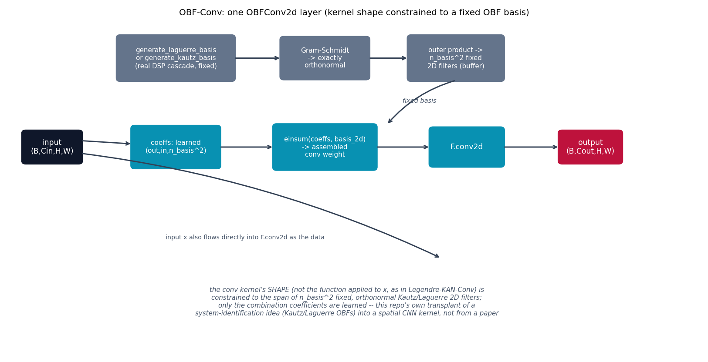
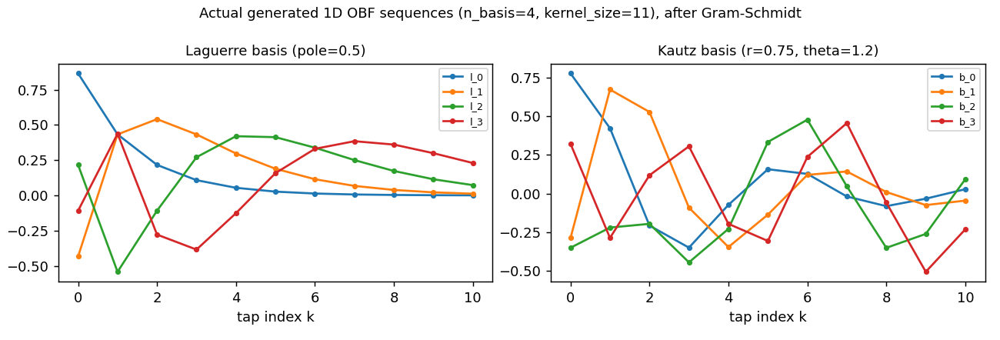

# OBF-Conv -- a Kautz/Laguerre kernel-shape basis

**Not a single published paper -- this repo's own combination, stated
plainly up front.** Kautz and Laguerre orthonormal basis functions (OBFs)
are real, established tools {cite}`wahlberg1991laguerre,oliveira2011obf`
-- but exclusively in linear *system identification*: given a prior about
a system's dominant decay rate (Laguerre, one real pole) or resonant
frequency (Kautz, a complex-conjugate pole pair), an FIR/Volterra impulse
response can be represented compactly as a short combination of B fixed
basis sequences instead of many free taps. As far as could be found by
searching the literature while building this repo, no CNN-kernel paper
applies this as a *spatial* kernel parameterization for 2D (or 3D)
vision. Read this page as "this repo's design," not as reproducing
anyone's published architecture.

Contrast with {doc}`legendrekan` (built just before this model): that one
puts its polynomial basis over the *pixel intensity value* at a tap (a
KAN-style learned nonlinear edge function). OBF-Conv puts its basis over
the *tap/spatial index* of the kernel itself -- constraining the kernel's
receptive-field *shape*, not the function applied to what's under it.
That is the faithful transplant of what Kautz/Laguerre OBFs actually do
in system identification: a basis for an impulse response's *shape*,
given a decay/resonance prior.

## The equation

**Laguerre** (one real pole $\xi \in (0,1)$): $l_0$ is the impulse
response of a first-order lowpass gain stage,

$$
s[k] = \xi\, s[k-1] + u[k], \qquad l_0[k] = \sqrt{1-\xi^2}\; s[k]
$$

driven by a unit impulse ($u[0]=1$, else $0$), giving the closed form
$l_0[k] = \sqrt{1-\xi^2}\,\xi^k$. Each subsequent $l_b$ passes $l_{b-1}$
through the first-order all-pass section

$$
y[k] = \xi\, y[k-1] - \xi\, u[k] + u[k-1], \qquad
H(z) = \frac{z^{-1} - \xi}{1 - \xi z^{-1}}
$$

cascaded $b$ times -- the standard Laguerre OBF cascade realization
{cite}`wahlberg1991laguerre`.

**Kautz** (resonant pole pair $r\,e^{\pm j\theta}$): built from the
second-order resonant section

$$
y[k] = 2r\cos(\theta)\, y[k-1] - r^2\, y[k-2] + u[k]
$$

The first basis pair are this section's responses to a unit impulse at
$k=0$ and at $k=1$ (verified numerically while building this: an impulse
and its one-sample-delayed twin excite genuinely different phases of the
same resonance -- driving the *same* $k{=}0$ impulse with two different
amplitudes instead gives nearly-parallel, not phase-quadrature,
sequences). Further sequences cascade the same section, mirroring the
Laguerre construction.

Both raw sequences are only *approximately* orthonormal once truncated to
a finite `kernel_size` (exact orthonormality is an infinite-impulse-
response property) -- verified numerically: the raw Laguerre Gram matrix
is already close to the identity, the raw Kautz one is not. **Both are
passed through Gram-Schmidt** to guarantee an exactly orthonormal
finite-length basis regardless:

$$
\text{Conv weight}[o,i,:,:] \;=\; \sum_{b=1}^{n_\text{basis}^2} c_{o,i,b} \cdot \Phi_b, \qquad
\Phi_b = \phi_{b_1} \otimes \phi_{b_2}
$$

where $\{\phi_b\}$ is the (Gram-Schmidt-orthonormalized) 1D basis and
$\Phi_b$ its 2D outer-product filters -- only the coefficients $c$ are
learned; $\Phi_b$ is fixed.

## How it's built

`generate_laguerre_basis`, `generate_kautz_basis`, and `OBFConv2d.forward`
in
[`models/obfconv/model.py`](https://github.com/agpoks/cnn-playground/blob/main/models/obfconv/model.py):

```python
def generate_laguerre_basis(n_basis, kernel_size, pole):
    xi = pole
    s = 0.0
    l0 = []
    for k in range(kernel_size):
        u = 1.0 if k == 0 else 0.0
        s = xi * s + u
        l0.append(math.sqrt(1 - xi**2) * s)
    # ... cascade the all-pass section n_basis-1 more times ...


class OBFConv2d(nn.Module):
    def __init__(self, ...):
        basis_1d = generate_laguerre_basis(...)  # or generate_kautz_basis(...)
        basis_1d = _gram_schmidt(basis_1d)        # exact orthonormality
        basis_2d = torch.einsum("ik,jl->ijkl", basis_1d, basis_1d).reshape(n_basis * n_basis, k, k)
        self.register_buffer("basis_2d", basis_2d)   # fixed
        self.coeffs = nn.Parameter(torch.randn(out_ch, in_ch, n_basis * n_basis) / ...)  # learned

    def forward(self, x):
        weight = torch.einsum("oib,bkl->oikl", self.coeffs, self.basis_2d)
        return F.conv2d(x, weight, stride=self.stride, padding=self.padding)
```

`OBFConvModel` stacks three `OBFConv2d` blocks (each followed by
`BatchNorm` + `ReLU`), with an ordinary strided conv for downsampling
between the first two, then global average pool and a linear classifier
-- the identical shape to {doc}`legendrekan`'s `LegendreKANModel`, for a
direct benchmark comparison.



```{eval-rst}
.. plot::

    from cnn_playground.utils.diagrams import new_ax, box, arrow, INPUT, LINEAR, NONLIN, STATE, OTHER

    fig, ax = new_ax(figsize=(12.5, 6.4), xlim=(0, 19), ylim=(0, 10.5))

    box(ax, 1.2, 6.5, 1.6, 1.0, "input\n(B,Cin,H,W)", INPUT)

    box(ax, 4.6, 9.3, 3.2, 1.4, "generate_laguerre_basis\nor generate_kautz_basis\n(real DSP cascade, fixed)", OTHER, fontsize=8.3)
    box(ax, 8.7, 9.3, 2.4, 1.3, "Gram-Schmidt\n-> exactly\northonormal", OTHER, fontsize=8.5)
    box(ax, 12.3, 9.3, 2.6, 1.4, "outer product ->\nn_basis^2 fixed\n2D filters (buffer)", OTHER, fontsize=8.3)

    box(ax, 4.6, 6.5, 2.4, 1.3, "coeffs: learned\n(out,in,n_basis^2)", LINEAR, fontsize=8.5)
    box(ax, 8.7, 6.5, 2.8, 1.4, "einsum(coeffs, basis_2d)\n-> assembled\nconv weight", LINEAR, fontsize=8.3)
    box(ax, 12.6, 6.5, 2.0, 1.2, "F.conv2d", LINEAR)
    box(ax, 16.0, 6.5, 1.7, 1.0, "output\n(B,Cout,H,W)", STATE)

    arrow(ax, (6.2, 9.3), (7.5, 9.3))
    arrow(ax, (9.9, 9.3), (11.0, 9.3))
    arrow(ax, (12.3, 8.6), (10.4, 7.2), curve=0.15)
    ax.text(11.3, 7.9, "fixed basis", fontsize=8, ha="center", color="#475569", style="italic")

    arrow(ax, (5.8, 6.5), (7.3, 6.5))
    arrow(ax, (2.0, 6.7), (3.4, 6.6))
    arrow(ax, (10.1, 6.5), (11.6, 6.5))
    arrow(ax, (13.6, 6.5), (15.15, 6.5))
    arrow(ax, (2.0, 6.3), (11.9, 3.0), curve=-0.08)
    ax.text(6.5, 3.6, "input x also flows directly into F.conv2d as the data", fontsize=7.8, ha="center", color="#475569")

    ax.text(9.3, 1.2,
            "the conv kernel's SHAPE (not the function applied to x, as in Legendre-KAN-Conv) is\n"
            "constrained to the span of n_basis^2 fixed, orthonormal Kautz/Laguerre 2D filters;\n"
            "only the combination coefficients are learned -- this repo's own transplant of a\n"
            "system-identification idea (Kautz/Laguerre OBFs) into a spatial CNN kernel, not from a paper",
            fontsize=8.3, ha="center", color="#475569", style="italic")

    ax.set_title("OBF-Conv: one OBFConv2d layer (kernel shape constrained to a fixed OBF basis)", fontsize=11)
```

As concrete evidence the construction actually produces sensible basis
shapes (not just passes a numerical orthonormality check), here are the
real generated sequences for `n_basis=4`, `kernel_size=11`:



The Laguerre sequences show the expected monotone-decaying envelope with
increasing oscillation count per order; the Kautz sequences show
genuinely resonant, oscillatory shapes -- both after Gram-Schmidt, both
numerically verified orthonormal (max $|\text{Gram} - I| \approx 10^{-7}$
for both bases at `kernel_size=11`, see `model.py`'s `__main__` block).

**Simplifications / honesty note**, stated explicitly:

1. **This is an assembled/novel combination, not a single paper's
   architecture** (see the intro above) -- every claim on this page is
   "this repo's design," not a reproduction.
2. The 2D basis is built via a **separable outer product** of the 1D
   basis with itself. The true 2D-optimal OBF basis for an arbitrary
   receptive field is not generally separable -- this keeps the
   construction simple while still spanning a meaningfully constrained
   subspace.
3. The Kautz construction here (two-impulse-response pair + cascade,
   then Gram-Schmidt) is one reasonable real-DSP realization, not
   necessarily the exact classical 2-parameter Kautz filter-bank
   derivation found in the system-ID literature -- the module docstring
   in `model.py` states this choice explicitly.
4. Gram-Schmidt is applied to *correct* the finite-`kernel_size`
   truncation error that both raw OBF cascades leave behind, rather than
   relying on the cascades' asymptotic (infinite-length) orthonormality
   property directly.
5. `n_basis` is kept small (default 4, so `n_basis**2 = 16` fixed
   filters) so the learned coefficient tensor stays comparable in size to
   {doc}`legendrekan`'s parameter count for a fair benchmark comparison.

## Try it

```bash
python models/obfconv/example.py --device auto              # Laguerre basis (default)
python models/obfconv/example.py --device auto --basis kautz
```

or open [`models/obfconv/example.ipynb`](https://github.com/agpoks/cnn-playground/blob/main/models/obfconv/example.ipynb)
(it also plots the generated basis sequences and their orthonormality check).
Full runnable code: [`models/obfconv/model.py`](https://github.com/agpoks/cnn-playground/blob/main/models/obfconv/model.py) ·
[`models/obfconv/README.md`](https://github.com/agpoks/cnn-playground/blob/main/models/obfconv/README.md).

See {doc}`../model_comparison` for how this contrasts against
{doc}`legendrekan` (basis over pixel value vs. basis over spatial/tap
index) within the wider "structured kernel basis" theme.

## References

```{eval-rst}
.. bibliography::
   :filter: docname in docnames
```
