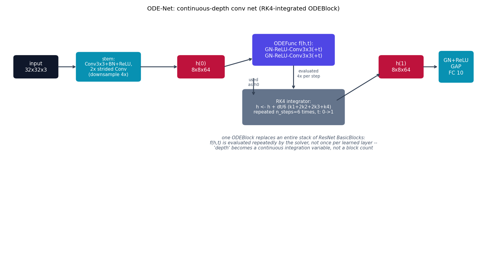

# ODE-Net -- continuous-depth conv nets

ODE-Net {cite}`chen2018odenet` observes that a {doc}`resnet` block's update
`y = x + F(x)` is one discrete Euler step of an ODE, and takes that
observation to its limit: instead of stacking a fixed number of discrete
residual blocks, parameterize the right-hand side once and integrate it
continuously. "Depth" becomes a solver's integration variable instead of a
layer count.

## The equation

A ResNet block computes one forward-Euler step of

$$
\frac{dh}{dt} = f(h(t), t, \theta)
$$

with step size 1, applied once per block. ODE-Net instead integrates this
ODE from $t=0$ to $t=1$ with a proper solver. This repo hand-rolls
fixed-step RK4:

$$
\begin{aligned}
k_1 &= f(h, t) \\
k_2 &= f(h + \tfrac{1}{2}\Delta t\, k_1,\ t + \tfrac{1}{2}\Delta t) \\
k_3 &= f(h + \tfrac{1}{2}\Delta t\, k_2,\ t + \tfrac{1}{2}\Delta t) \\
k_4 &= f(h + \Delta t\, k_3,\ t + \Delta t) \\
h &\leftarrow h + \frac{\Delta t}{6}(k_1 + 2k_2 + 2k_3 + k_4)
\end{aligned}
$$

repeated `n_steps` times ($\Delta t = 1/\text{n\_steps}$) to integrate from
$h(0)$ to $h(1)$. $f$ itself is conditioned on $t$ by concatenating a
constant-valued extra channel, so it is a genuine function of both state
and time, not just state.

## How it's built

`ODEBlock.forward` in
[`models/odenet/model.py`](https://github.com/agpoks/cnn-playground/blob/main/models/odenet/model.py)
is exactly the RK4 recurrence above:

```python
def forward(self, h0):
    dt = 1.0 / self.n_steps
    h, t = h0, 0.0
    for _ in range(self.n_steps):
        k1 = self.ode_func(h, t)
        k2 = self.ode_func(h + 0.5 * dt * k1, t + 0.5 * dt)
        k3 = self.ode_func(h + 0.5 * dt * k2, t + 0.5 * dt)
        k4 = self.ode_func(h + dt * k3, t + dt)
        h = h + (dt / 6.0) * (k1 + 2 * k2 + 2 * k3 + k4)
        t += dt
    return h
```

`ODEFunc` (the learned $f(h,t)$) is a small `GroupNorm -> ReLU -> Conv3x3`
stack, applied twice, with $t$ concatenated as an extra channel before each
conv. `ODENetModel` runs a downsampling stem (plays the same role as
ResNet's stem + early stages: reach a manageable spatial size cheaply),
then **one** `ODEBlock` -- replacing ResNet's entire stack of later-stage
`BasicBlock`s -- then `GroupNorm+ReLU`, global average pool, and a linear
classifier.

**Simplifications vs. the paper**, stated explicitly: the paper uses a
black-box *adaptive-step* solver (e.g. `dopri5`) together with the adjoint
sensitivity method, which backpropagates in O(1) memory regardless of how
many solver steps were taken internally. This repo uses a fixed number of
RK4 steps (`n_steps`, default 6) and backpropagates directly through the
unrolled solver via ordinary autograd -- much simpler to write from
primitives (no `torchdiffeq` or other ODE-solver library anywhere), at the
cost of memory that scales with `n_steps` (irrelevant at this model's
size, since it never approaches the ImageNet-scale depths the paper's
memory argument targets).



```{eval-rst}
.. plot::

    from cnn_playground.utils.diagrams import new_ax, box, arrow, INPUT, LINEAR, NONLIN, STATE, OTHER

    fig, ax = new_ax(figsize=(12.5, 6.5), xlim=(0, 19), ylim=(0, 11))

    box(ax, 1.2, 8.5, 1.7, 1.0, "input\n32x32x3", INPUT)
    box(ax, 4.1, 8.5, 2.5, 1.3, "stem:\nConv3x3+BN+ReLU,\n2x strided Conv\n(downsample 4x)", LINEAR, fontsize=8.5)
    box(ax, 7.8, 8.5, 1.8, 1.0, "h(0)\n8x8x64", STATE)

    box(ax, 11.5, 9.3, 3.2, 1.4, "ODEFunc f(h,t):\nGN-ReLU-Conv3x3(+t)\nGN-ReLU-Conv3x3(+t)", NONLIN)
    box(ax, 11.5, 6.6, 4.0, 1.6, "RK4 integrator:\nh <- h + dt/6 (k1+2k2+2k3+k4)\nrepeated n_steps=6 times, t: 0->1", OTHER, fontsize=8.5)

    box(ax, 15.8, 8.5, 1.7, 1.0, "h(1)\n8x8x64", STATE)
    box(ax, 18.0, 8.5, 1.3, 1.4, "GN+ReLU\nGAP\nFC 10", LINEAR)

    arrow(ax, (2.05, 8.5), (2.85, 8.5))
    arrow(ax, (5.35, 8.5), (6.9, 8.5))
    arrow(ax, (8.7, 8.5), (9.9, 8.9))
    arrow(ax, (9.9, 8.0), (9.9, 7.1))
    ax.text(9.9, 7.6, "used\nas h0", fontsize=7.5, ha="center", color="#475569")
    arrow(ax, (11.5, 8.6), (11.5, 7.4), curve=0.0)
    ax.text(12.1, 8.0, "evaluated\n4x per step", fontsize=7.5, ha="center", color="#475569")
    arrow(ax, (13.2, 6.9), (15.0, 8.2))
    arrow(ax, (16.65, 8.5), (17.3, 8.5))

    ax.text(11.5, 4.6,
            "one ODEBlock replaces an entire stack of ResNet BasicBlocks:\n"
            "f(h,t) is evaluated repeatedly by the solver, not once per learned layer --\n"
            "'depth' becomes a continuous integration variable, not a block count",
            fontsize=8.5, ha="center", color="#475569", style="italic")

    ax.set_title("ODE-Net: continuous-depth conv net (RK4-integrated ODEBlock)", fontsize=11)
```

See {doc}`../model_comparison` for a direct discrete-vs-continuous
contrast against {doc}`resnet`, which shares the exact same underlying
residual idea. {doc}`liquidode` takes this one step further: same
continuous-depth integration, but `dh/dt` is a Liquid-Time-Constant-gated
equation instead of a plain conv net -- see that page and
`models/liquidode/model.py` for the honesty note on why that's this
repo's own combination, not a reproduction of a single paper.

## Try it

```bash
python models/odenet/example.py --device auto     # trains on real CIFAR-10
```

or open [`models/odenet/example.ipynb`](https://github.com/agpoks/cnn-playground/blob/main/models/odenet/example.ipynb).
Full runnable code: [`models/odenet/model.py`](https://github.com/agpoks/cnn-playground/blob/main/models/odenet/model.py) ·
[`models/odenet/README.md`](https://github.com/agpoks/cnn-playground/blob/main/models/odenet/README.md).

## References

```{eval-rst}
.. bibliography::
   :filter: docname in docnames
```
