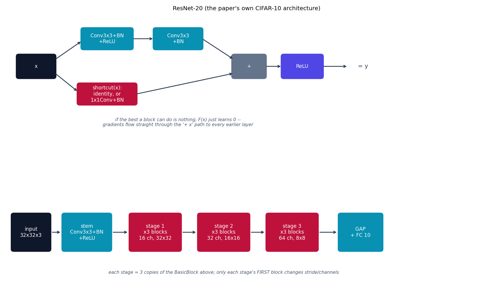

# ResNet -- identity ("residual") skip connections

Before ResNet {cite}`he2016resnet`, stacking more conv layers eventually
made both training *and* test error worse -- not from overfitting, but
because very deep networks became hard to optimize at all (paper Fig. 1).
The fix: instead of asking each block to learn a full mapping $H(x)$, let
it learn only the residual $F(x) = H(x) - x$, and add the input back
explicitly.

## The architecture

$$
y = \mathrm{ReLU}\bigl(F(x) + \mathrm{shortcut}(x)\bigr)
$$

If the best thing a block can do is nothing, $F(x)$ only has to learn to
output zero -- trivial for a network to do -- and gradients can flow
straight through the `+ x` term to every earlier layer regardless of how
deep the stack is. `shortcut(x)` is the identity when a block's
input/output shapes already match; when a block changes channel count or
downsamples spatially (the first block of each new stage below),
`shortcut` is instead a 1x1 conv + BatchNorm "projection shortcut" (paper
Sec. 3.2) so the two branches can still be added elementwise.

This is **the paper's own CIFAR-10 architecture** (Sec. 4.2), not its
ImageNet one: a plain 3x3-conv stem (no aggressive 7x7-stride-2 + maxpool,
which would throw away too much of a 32x32 image immediately), then 3
stages of BasicBlocks with 16/32/64 channels, downsampling only via the
stride of each stage's first block. `n=3` blocks per stage ("ResNet-20" in
the paper's naming, `6n+2=20` weight layers) trades the paper's deeper
CIFAR variants (up to ResNet-110) for CPU training speed.

## How it's built

`BasicBlock.forward` in
[`models/resnet/model.py`](https://github.com/agpoks/cnn-playground/blob/main/models/resnet/model.py)
is exactly the equation above:

```python
def forward(self, x):
    out = self.relu(self.bn1(self.conv1(x)))
    out = self.bn2(self.conv2(out))
    return self.relu(out + self.shortcut(x))
```

with `self.shortcut` built once in `__init__`:

```python
if stride != 1 or in_channels != out_channels:
    self.shortcut = nn.Sequential(
        nn.Conv2d(in_channels, out_channels, kernel_size=1, stride=stride, bias=False),
        nn.BatchNorm2d(out_channels),
    )
else:
    self.shortcut = nn.Identity()
```

`ResNetModel` stacks 3 stages of 3 `BasicBlock`s each (16/32/64 channels),
downsampling only at each stage's first block. Compare this to
{doc}`googlenet`'s parallel-branch idea -- ResNet goes deep by making each
individual layer easier to optimize, not by widening what one layer
computes. {doc}`odenet` takes the residual idea one step further: a
`BasicBlock`'s `y = x + F(x)` is one discrete Euler step of an ODE, and
ODE-Net replaces the whole discrete stack with one function integrated
continuously -- see {doc}`../model_comparison` for the direct comparison.



```{eval-rst}
.. plot::

    from cnn_playground.utils.diagrams import new_ax, box, arrow, INPUT, LINEAR, NONLIN, STATE, OTHER

    fig, ax = new_ax(figsize=(13.0, 7.5), xlim=(0, 19), ylim=(0, 11.5))

    box(ax, 1.2, 9.2, 1.5, 1.0, "x", INPUT)
    box(ax, 4.0, 10.4, 2.0, 0.9, "Conv3x3+BN\n+ReLU", LINEAR)
    box(ax, 6.8, 10.4, 1.9, 0.9, "Conv3x3\n+BN", LINEAR)
    box(ax, 4.0, 8.0, 2.3, 0.9, "shortcut(x):\nidentity, or\n1x1Conv+BN", STATE)
    box(ax, 9.6, 9.2, 1.3, 1.0, "+", OTHER)
    box(ax, 11.7, 9.2, 1.6, 1.0, "ReLU", NONLIN)

    arrow(ax, (1.95, 9.5), (3.0, 10.3))
    arrow(ax, (5.0, 10.4), (5.85, 10.4))
    arrow(ax, (7.75, 10.4), (9.0, 9.5))
    arrow(ax, (1.95, 8.9), (2.85, 8.1))
    arrow(ax, (5.15, 8.0), (9.0, 8.9))
    arrow(ax, (10.25, 9.2), (10.9, 9.2))
    arrow(ax, (12.5, 9.2), (13.5, 9.2))
    ax.text(13.9, 9.2, "= y", fontsize=11, va="center", color="#334155")

    ax.text(6.8, 6.6,
            "if the best a block can do is nothing, F(x) just learns 0 --\n"
            "gradients flow straight through the '+ x' path to every earlier layer",
            fontsize=8.5, ha="center", color="#475569", style="italic")

    cy = 2.0
    boxes = [
        (1.0, "input\n32x32x3", 1.5, INPUT),
        (3.2, "stem\nConv3x3+BN\n+ReLU", 1.9, LINEAR),
        (5.9, "stage 1\nx3 blocks\n16 ch, 32x32", 2.0, STATE),
        (8.6, "stage 2\nx3 blocks\n32 ch, 16x16", 2.0, STATE),
        (11.3, "stage 3\nx3 blocks\n64 ch, 8x8", 2.0, STATE),
        (14.0, "GAP\n+ FC 10", 1.7, LINEAR),
    ]
    prev_x, prev_w = None, None
    for x, text, w, color in boxes:
        box(ax, x, cy, w, 1.6, text, color)
        if prev_x is not None:
            arrow(ax, (prev_x + prev_w / 2 + 0.05, cy), (x - w / 2 - 0.05, cy))
        prev_x, prev_w = x, w

    ax.text(8.6, 0.2,
            "each stage = 3 copies of the BasicBlock above; only each stage's FIRST block changes stride/channels",
            fontsize=8.5, ha="center", color="#475569", style="italic")
    ax.set_title("ResNet-20 (the paper's own CIFAR-10 architecture)", fontsize=11)
```

## Try it

```bash
python models/resnet/example.py --device auto     # trains on real CIFAR-10
```

or open [`models/resnet/example.ipynb`](https://github.com/agpoks/cnn-playground/blob/main/models/resnet/example.ipynb).
Full runnable code: [`models/resnet/model.py`](https://github.com/agpoks/cnn-playground/blob/main/models/resnet/model.py) ·
[`models/resnet/README.md`](https://github.com/agpoks/cnn-playground/blob/main/models/resnet/README.md).

## References

```{eval-rst}
.. bibliography::
   :filter: docname in docnames
```
