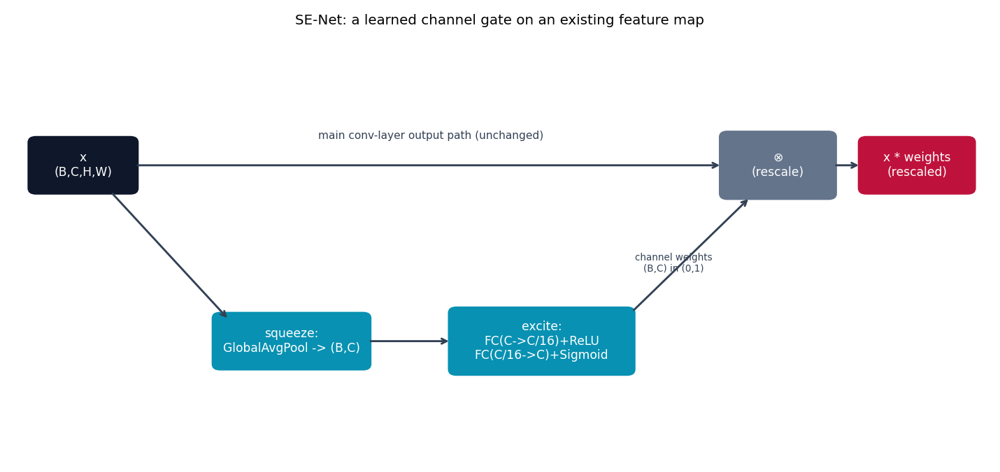

# SE-Net -- a learned per-channel gate

Every conv layer elsewhere in this repo treats every output channel as
equally important, regardless of what's actually in the image. SE-Net
{cite}`hu2018senet` adds a cheap, learned gate that reweights channels
based on the *whole* feature map.

## The architecture

The Squeeze-and-Excitation (SE) block: (1) **squeeze** -- global-average-pool
each channel down to one scalar, giving a `(B, C)` descriptor of "how
active is each channel, on average, over the whole image"; (2) **excite**
-- pass that through a small bottleneck MLP
(`Linear(C -> C/16) -> ReLU -> Linear(C/16 -> C) -> Sigmoid`) to get a
`(B, C)` set of per-channel weights in `(0, 1)`; (3) **rescale** --
multiply the original feature map by those weights, broadcasting over the
spatial dimensions. The paper's whole point is that this is a **drop-in
addition to an existing backbone** ("SE-ResNet"), not a new architecture by
itself.

## How it's built

```python
class SEBlock(nn.Module):
    def __init__(self, channels, reduction=16):
        super().__init__()
        reduced = max(channels // reduction, 4)
        self.pool = nn.AdaptiveAvgPool2d(1)
        self.fc = nn.Sequential(
            nn.Linear(channels, reduced), nn.ReLU(inplace=True),
            nn.Linear(reduced, channels), nn.Sigmoid(),
        )

    def forward(self, x):
        b, c, _, _ = x.shape
        weights = self.fc(self.pool(x).view(b, c)).view(b, c, 1, 1)
        return x * weights
```

[`models/senet/model.py`](https://github.com/agpoks/cnn-playground/blob/main/models/senet/model.py)
inserts one `SEBlock` into each residual block of a small CIFAR-style
backbone, right before the skip-connection addition. `example.py` trains
**both** the plain backbone and the SE-augmented version and prints both
accuracies -- an honest ablation instead of just asserting SE helps.



```{eval-rst}
.. plot::

    from cnn_playground.utils.diagrams import new_ax, box, arrow, INPUT, LINEAR, STATE, OTHER

    fig, ax = new_ax(figsize=(11.0, 5.2), xlim=(0, 14), ylim=(0, 8))

    box(ax, 1.0, 5.5, 1.5, 1.0, "x\n(B,C,H,W)", INPUT)
    box(ax, 11.0, 5.5, 1.6, 1.2, "⊗\n(rescale)", OTHER)
    box(ax, 13.0, 5.5, 1.6, 1.0, "x * weights\n(rescaled)", STATE)

    box(ax, 4.0, 2.2, 2.2, 1.0, "squeeze:\nGlobalAvgPool -> (B,C)", LINEAR)
    box(ax, 7.6, 2.2, 2.6, 1.2, "excite:\nFC(C->C/16)+ReLU\nFC(C/16->C)+Sigmoid", LINEAR)

    arrow(ax, (1.75, 5.5), (10.2, 5.5))
    ax.text(6.0, 6.0, "main conv-layer output path (unchanged)", fontsize=8.5, ha="center", color="#334155")
    arrow(ax, (11.8, 5.5), (12.2, 5.5))
    arrow(ax, (1.4, 5.0), (3.1, 2.6))
    arrow(ax, (5.1, 2.2), (6.3, 2.2))
    arrow(ax, (8.9, 2.75), (10.6, 4.9))
    ax.text(9.5, 3.5, "channel weights\n(B,C) in (0,1)", fontsize=7.5, ha="center", color="#334155")

    ax.set_title("SE-Net: a learned channel gate on an existing feature map", fontsize=11)
```

## Try it

```bash
python models/senet/example.py --device auto     # trains real CIFAR-10, plain vs. SE-augmented
```

or open [`models/senet/example.ipynb`](https://github.com/agpoks/cnn-playground/blob/main/models/senet/example.ipynb).
Full runnable code: [`models/senet/model.py`](https://github.com/agpoks/cnn-playground/blob/main/models/senet/model.py) ·
[`models/senet/README.md`](https://github.com/agpoks/cnn-playground/blob/main/models/senet/README.md).

## References

```{eval-rst}
.. bibliography::
   :filter: docname in docnames
```
