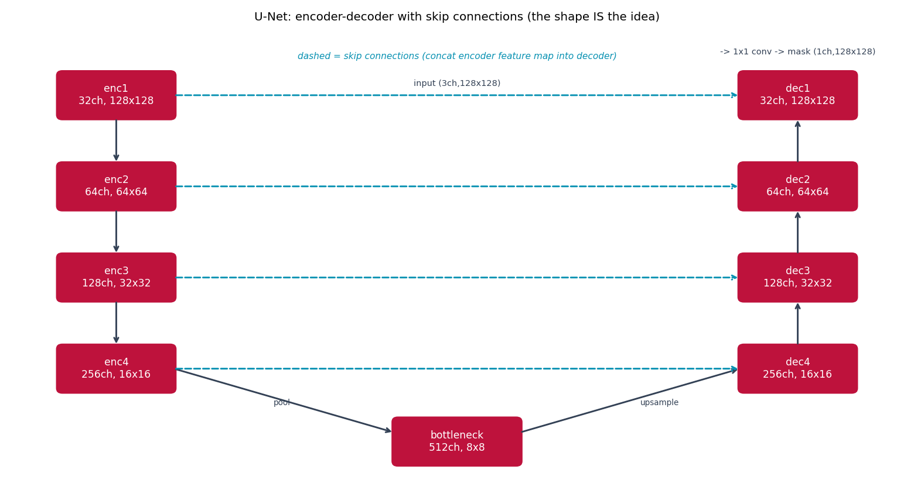

# U-Net -- per-pixel prediction, not per-image

Every other model in this repo reduces an image down to one label. U-Net
{cite}`ronneberger2015unet` keeps the same conv/pool vocabulary but reuses
it for a *dense* prediction task: one label per pixel.

## The architecture

A contracting (encoder) path downsamples and deepens the feature maps like
an ordinary CNN classifier; a symmetric expanding (decoder) path upsamples
back to the original resolution. The key idea is the **skip connection**:
at each decoder stage, the same-resolution encoder feature map is
concatenated in before convolving further, giving the decoder both the
encoder's deep semantic features *and* the fine spatial detail pooling
would otherwise have discarded.

Simplification vs. the paper: this uses `padding=1` ("same") convolutions
throughout instead of the paper's unpadded ("valid") ones, so encoder and
decoder feature maps at matching stages are already the same spatial size
-- no cropping needed at the skip connections -- and a smaller channel
count (32→64→128→256, bottleneck 512, vs. the paper's 64→128→256→512/1024)
to keep CPU training time reasonable. The encoder/decoder structure itself
is unchanged.

## How it's built

```python
def forward(self, x: torch.Tensor) -> torch.Tensor:
    e1 = self.enc1(x)
    e2 = self.enc2(self.pool(e1))
    e3 = self.enc3(self.pool(e2))
    e4 = self.enc4(self.pool(e3))
    b = self.bottleneck(self.pool(e4))

    d4 = self.dec4(torch.cat([self.up4(b), e4], dim=1))
    d3 = self.dec3(torch.cat([self.up3(d4), e3], dim=1))
    d2 = self.dec2(torch.cat([self.up2(d3), e2], dim=1))
    d1 = self.dec1(torch.cat([self.up1(d2), e1], dim=1))
    return self.head(d1)
```

Each `torch.cat` is a skip connection: the decoder's upsampled feature map
is concatenated with its matching encoder stage before the next
`DoubleConv`. See
[`models/unet/model.py`](https://github.com/agpoks/cnn-playground/blob/main/models/unet/model.py)
for `DoubleConv` (`[Conv3x3 -> ReLU -> Conv3x3 -> ReLU]`, same spatial size
in and out).



```{eval-rst}
.. plot::

    from cnn_playground.utils.diagrams import new_ax, box, arrow, STATE

    fig, ax = new_ax(figsize=(12.0, 6.5), xlim=(0, 17), ylim=(0, 10))

    e1 = box(ax, 2.0, 8.5, 2.2, 1.0, "enc1\n32ch, 128x128", STATE)
    e2 = box(ax, 2.0, 6.5, 2.2, 1.0, "enc2\n64ch, 64x64", STATE)
    e3 = box(ax, 2.0, 4.5, 2.2, 1.0, "enc3\n128ch, 32x32", STATE)
    e4 = box(ax, 2.0, 2.5, 2.2, 1.0, "enc4\n256ch, 16x16", STATE)
    bott = box(ax, 8.5, 0.9, 2.4, 1.0, "bottleneck\n512ch, 8x8", STATE)
    d4 = box(ax, 15.0, 2.5, 2.2, 1.0, "dec4\n256ch, 16x16", STATE)
    d3 = box(ax, 15.0, 4.5, 2.2, 1.0, "dec3\n128ch, 32x32", STATE)
    d2 = box(ax, 15.0, 6.5, 2.2, 1.0, "dec2\n64ch, 64x64", STATE)
    d1 = box(ax, 15.0, 8.5, 2.2, 1.0, "dec1\n32ch, 128x128", STATE)

    arrow(ax, (2.0, 8.0), (2.0, 7.0))
    arrow(ax, (2.0, 6.0), (2.0, 5.0))
    arrow(ax, (2.0, 4.0), (2.0, 3.0))
    arrow(ax, (3.1, 2.5), (7.3, 1.1))
    ax.text(5.0, 1.7, "pool", fontsize=7.5, color="#334155")
    arrow(ax, (9.7, 1.1), (13.9, 2.5))
    ax.text(12.0, 1.7, "upsample", fontsize=7.5, color="#334155")
    arrow(ax, (15.0, 3.0), (15.0, 4.0))
    arrow(ax, (15.0, 5.0), (15.0, 6.0))
    arrow(ax, (15.0, 7.0), (15.0, 8.0))

    for (a, b) in [(e1, d1), (e2, d2), (e3, d3), (e4, d4)]:
        arrow(ax, (a[0] + a[2] / 2, a[1]), (b[0] - b[2] / 2, b[1]), dashed=True, color="#0891b2")

    ax.text(8.5, 9.3, "dashed = skip connections (concat encoder feature map into decoder)",
            fontsize=8.5, ha="center", color="#0891b2", style="italic")

    ax.set_title("U-Net: encoder-decoder with skip connections (the shape IS the idea)", fontsize=11)
```

## Try it

```bash
python models/unet/example.py --device auto     # trains on real Oxford-IIIT Pet segmentation masks
```

or open [`models/unet/example.ipynb`](https://github.com/agpoks/cnn-playground/blob/main/models/unet/example.ipynb),
which also plots real image/mask/prediction triples. Full runnable code:
[`models/unet/model.py`](https://github.com/agpoks/cnn-playground/blob/main/models/unet/model.py) ·
[`models/unet/README.md`](https://github.com/agpoks/cnn-playground/blob/main/models/unet/README.md).

## References

```{eval-rst}
.. bibliography::
   :filter: docname in docnames
```
