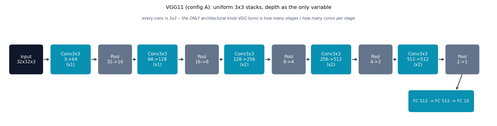

# VGG -- uniform 3x3 stacks, depth as the only variable

VGG {cite}`simonyan2014vgg`'s core idea: **only 3x3 convolutions, stacked,
with 2x2 max-pool between stages, and channel count doubling each stage**
-- depth is the only architectural knob, unlike {doc}`alexnet`'s mixed
kernel sizes (3x3 here, 5x5/11x11 there).

## The architecture

This module is the paper's simplest listed configuration, "config A" /
VGG11 (8 conv layers + 3 FC layers), with its exact per-stage conv counts
(1, 1, 2, 2, 2) and channel progression (64, 128, 256, 512, 512):

```
32x32 -> [Conv(3->64)]                    -> MaxPool : 32->16
       -> [Conv(64->128)]                  -> MaxPool : 16->8
       -> [Conv(128->256), Conv(256->256)] -> MaxPool : 8->4
       -> [Conv(256->512), Conv(512->512)] -> MaxPool : 4->2
       -> [Conv(512->512), Conv(512->512)] -> MaxPool : 2->1
Flatten (512) -> FC(512) -> Dropout -> FC(512) -> Dropout -> FC(10)
```

Five stride-2 pooling stages take CIFAR-10's 32x32 down to exactly 1x1,
which is why the FC classifier here is much smaller (512 -> 512 -> 10)
than the paper's own 4096-wide classifier (built for a 7x7x512 feature map
from 224x224 ImageNet input) -- a CPU-speed-motivated reduction to the
classifier only, not a change to the conv stack, which keeps VGG11's exact
recipe.

## How it's built

`VGG.forward` in
[`models/vgg/model.py`](https://github.com/agpoks/cnn-playground/blob/main/models/vgg/model.py)
is literally that stage list, built from one repeated block:

```python
def _conv_block(in_ch, out_ch):
    return nn.Sequential(nn.Conv2d(in_ch, out_ch, kernel_size=3, padding=1), nn.ReLU(inplace=True))

self.features = nn.Sequential(
    _conv_block(3, 64),   nn.MaxPool2d(2, 2),
    _conv_block(64, 128), nn.MaxPool2d(2, 2),
    _conv_block(128, 256), _conv_block(256, 256), nn.MaxPool2d(2, 2),
    _conv_block(256, 512), _conv_block(512, 512), nn.MaxPool2d(2, 2),
    _conv_block(512, 512), _conv_block(512, 512), nn.MaxPool2d(2, 2),
)
```

Every conv anywhere in the network is `kernel_size=3`. Compare this to
{doc}`googlenet`, the next model in this repo, which asks "what if a layer
didn't have to commit to one kernel size at all?"



```{eval-rst}
.. plot::

    from cnn_playground.utils.diagrams import new_ax, box, arrow, INPUT, LINEAR, NONLIN, STATE, OTHER

    fig, ax = new_ax(figsize=(15.0, 3.8), xlim=(0, 23), ylim=(0, 5.5))

    boxes = [
        (1.0, "input\n32x32x3", 1.5, INPUT),
        (3.1, "Conv3x3\n3->64\n(x1)", 1.8, LINEAR),
        (5.2, "Pool\n32->16", 1.5, OTHER),
        (7.2, "Conv3x3\n64->128\n(x1)", 1.8, LINEAR),
        (9.3, "Pool\n16->8", 1.5, OTHER),
        (11.3, "Conv3x3\n128->256\n(x2)", 1.8, LINEAR),
        (13.4, "Pool\n8->4", 1.5, OTHER),
        (15.4, "Conv3x3\n256->512\n(x2)", 1.8, LINEAR),
        (17.5, "Pool\n4->2", 1.5, OTHER),
        (19.5, "Conv3x3\n512->512\n(x2)", 1.8, LINEAR),
        (21.6, "Pool\n2->1", 1.5, OTHER),
    ]
    cy = 3.1
    prev_x, prev_w = None, None
    for x, text, w, color in boxes:
        box(ax, x, cy, w, 1.4, text, color)
        if prev_x is not None:
            arrow(ax, (prev_x + prev_w / 2 + 0.05, cy), (x - w / 2 - 0.05, cy))
        prev_x, prev_w = x, w

    box(ax, 20.6, 1.0, 3.0, 1.0, "FC 512 -> FC 512 -> FC 10", LINEAR, fontsize=9)
    arrow(ax, (21.6, 3.1 - 0.7 - 0.02), (21.3, 1.0 + 0.5 + 0.02))

    ax.text(11.5, 5.1,
            "every conv is 3x3 -- the ONLY architectural knob VGG turns is how many stages / how many convs per stage",
            fontsize=8.5, ha="center", color="#475569", style="italic")
    ax.set_title("VGG11 (config A): uniform 3x3 stacks, depth as the only variable", fontsize=11)
```

## Try it

```bash
python models/vgg/example.py --device auto     # trains on real CIFAR-10
```

or open [`models/vgg/example.ipynb`](https://github.com/agpoks/cnn-playground/blob/main/models/vgg/example.ipynb).
Full runnable code: [`models/vgg/model.py`](https://github.com/agpoks/cnn-playground/blob/main/models/vgg/model.py) ·
[`models/vgg/README.md`](https://github.com/agpoks/cnn-playground/blob/main/models/vgg/README.md).

## References

```{eval-rst}
.. bibliography::
   :filter: docname in docnames
```
