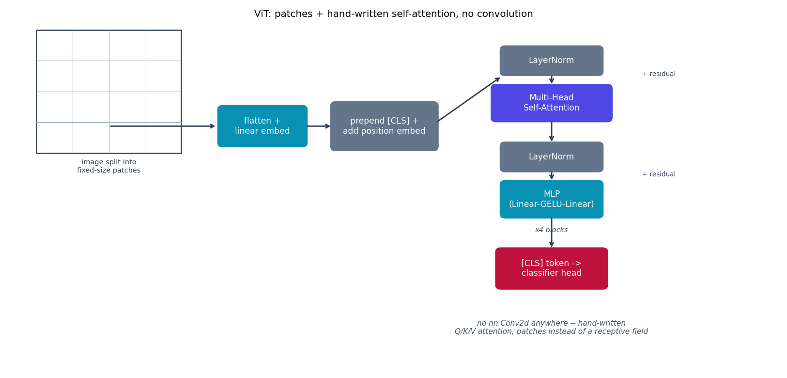

# ViT -- no convolution at all

Every other model in this repo is built from `nn.Conv2d`. Vision
Transformer {cite}`dosovitskiy2021vit` is the deliberate contrast baseline
in this repo: it removes convolution entirely, to answer "what does
convolution's inductive bias actually buy you" (see
{doc}`../model_comparison`).

## The equation

An image is cut into fixed-size patches, each linearly embedded (exactly
like a word embedding), a learned `[CLS]` token is prepended, a learned
position embedding is added, and the sequence goes through a plain
Transformer encoder. Multi-head self-attention (hand-written here, not
`nn.MultiheadAttention`):

$$
\text{Attention}(Q,K,V) = \text{softmax}\!\left(\frac{QK^\top}{\sqrt{d_{\text{head}}}}\right)V
$$

with $Q, K, V$ all linear projections of the same input sequence.

## How it's built

```python
class MultiHeadSelfAttention(nn.Module):
    def forward(self, x):
        B, N, D = x.shape
        qkv = self.qkv(x).reshape(B, N, 3, self.n_heads, self.head_dim).permute(2, 0, 3, 1, 4)
        q, k, v = qkv[0], qkv[1], qkv[2]
        attn = (q @ k.transpose(-2, -1)) / (self.head_dim ** 0.5)
        attn = attn.softmax(dim=-1)
        out = (attn @ v).transpose(1, 2).reshape(B, N, D)
        return self.proj(out)
```

`image_to_patches` in
[`models/vit/model.py`](https://github.com/agpoks/cnn-playground/blob/main/models/vit/model.py)
splits a `(B,3,32,32)` CIFAR-10 image into `8x8=64` non-overlapping `4x4`
patches via `.unfold()`; `EncoderBlock` is a standard pre-LN block
(`x = x + Attn(LN(x))`, then `x = x + MLP(LN(x))`), stacked 4 times. There
is no spatial inductive bias anywhere -- the model has to *learn* that
nearby pixels are related, instead of getting that for free from a
convolution's receptive field. The paper itself says ViT needs much more
pretraining data than a CNN to reach comparable accuracy; trained on
CIFAR-10 alone with no large-scale pretraining, at the epoch budgets used
here it is *expected* to trail the CNNs elsewhere in this repo -- that gap
is the finding this baseline exists to show, not a bug to apologize for.



```{eval-rst}
.. plot::

    from cnn_playground.utils.diagrams import new_ax, box, arrow, NONLIN, LINEAR, STATE, OTHER
    import matplotlib.patches as mpatches

    fig, ax = new_ax(figsize=(12.5, 6.0), xlim=(0, 17), ylim=(0, 9))

    img_x0, img_y0, img_s = 0.6, 5.6, 3.2
    ax.add_patch(mpatches.Rectangle((img_x0, img_y0), img_s, img_s, fill=False, edgecolor="#334155", linewidth=1.4))
    for i in range(1, 4):
        t = img_x0 + i * img_s / 4
        ax.plot([t, t], [img_y0, img_y0 + img_s], color="#94a3b8", linewidth=0.6)
        t2 = img_y0 + i * img_s / 4
        ax.plot([img_x0, img_x0 + img_s], [t2, t2], color="#94a3b8", linewidth=0.6)
    ax.text(img_x0 + img_s / 2, img_y0 - 0.5, "image split into\nfixed-size patches", fontsize=8, ha="center", color="#334155")

    box(ax, 5.6, 6.3, 1.9, 1.0, "flatten +\nlinear embed", LINEAR)
    box(ax, 8.3, 6.3, 2.3, 1.2, "prepend [CLS] +\nadd position embed", OTHER)

    blk_x = 12.0
    box(ax, blk_x, 8.0, 2.2, 0.7, "LayerNorm", OTHER)
    box(ax, blk_x, 6.9, 2.6, 0.9, "Multi-Head\nSelf-Attention", NONLIN)
    box(ax, blk_x, 5.5, 2.2, 0.7, "LayerNorm", OTHER)
    box(ax, blk_x, 4.4, 2.2, 0.9, "MLP\n(Linear-GELU-Linear)", LINEAR)
    box(ax, blk_x, 2.6, 2.4, 1.0, "[CLS] token ->\nclassifier head", STATE)

    arrow(ax, (2.2, 6.3), (4.6, 6.3))
    arrow(ax, (6.55, 6.3), (7.15, 6.3))
    arrow(ax, (9.45, 6.4), (10.9, 7.6))
    arrow(ax, (12.0, 7.65), (12.0, 7.35))
    ax.text(14.0, 7.6, "+ residual", fontsize=7.5, color="#334155")
    arrow(ax, (12.0, 6.45), (12.0, 5.85))
    arrow(ax, (12.0, 5.15), (12.0, 4.85))
    ax.text(14.0, 5.0, "+ residual", fontsize=7.5, color="#334155")
    arrow(ax, (12.0, 3.95), (12.0, 3.1))

    ax.text(12.0, 3.55, "x4 blocks", fontsize=8, ha="center", color="#475569", style="italic")

    ax.set_title("ViT: patches + hand-written self-attention, no convolution", fontsize=11)
```

## Try it

```bash
python models/vit/example.py --device auto     # trains on real CIFAR-10
```

or open [`models/vit/example.ipynb`](https://github.com/agpoks/cnn-playground/blob/main/models/vit/example.ipynb),
which also visualizes the patch grid. Full runnable code:
[`models/vit/model.py`](https://github.com/agpoks/cnn-playground/blob/main/models/vit/model.py) ·
[`models/vit/README.md`](https://github.com/agpoks/cnn-playground/blob/main/models/vit/README.md).

## References

```{eval-rst}
.. bibliography::
   :filter: docname in docnames
```
