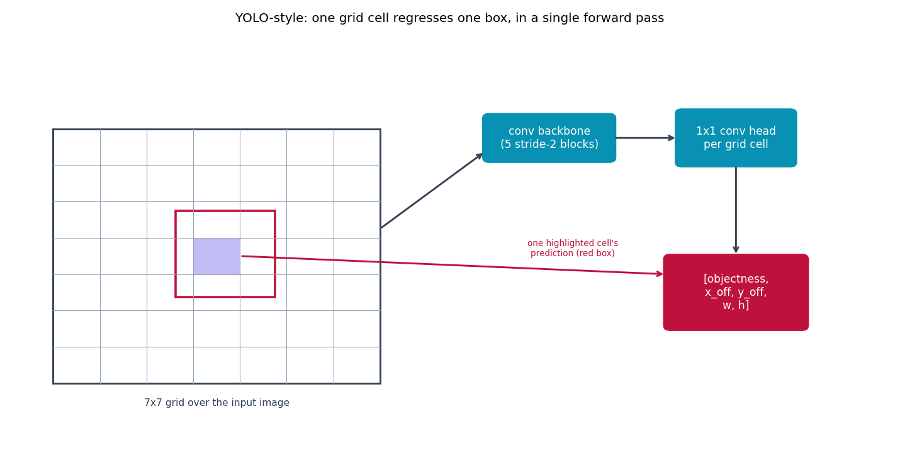

# YOLO-style detector -- classification to detection

Every other model in this repo predicts one label for the whole image.
YOLO {cite}`redmon2016yolo` divides the image into an `SxS` grid and has
every grid cell directly regress "is an object centered here, and if so,
where exactly and how big" -- one single forward pass, no region
proposals, no sliding window. This is the generalization from
classification to *detection*.

## The equation

The loss kept from the paper (its Eq. 3): binary cross-entropy on
objectness across *every* cell, but coordinate-regression loss only on
cells that actually have a real box assigned, with the paper's
$\lambda_{\text{coord}}=5$ / $\lambda_{\text{noobj}}=0.5$ reweighting --
without it, the far more numerous empty cells dominate the loss and
objectness collapses to zero:

$$
\mathcal{L} = \lambda_{\text{coord}} \sum_{\text{cells w/ obj}} \|\hat{p} - p\|^2 \;+\; \text{BCE}(\hat{o}, o) \;+\; \lambda_{\text{noobj}} \cdot \text{BCE}_{\text{empty cells}}
$$

**Simplifications** (stated explicitly -- the full YOLO v1 predicts 2
anchor boxes per cell and per-class probabilities across many classes):
single anchor box per cell, single class (Penn-Fudan is "pedestrian" only
-- no class head needed, just objectness + box geometry), and plain MSE on
width/height instead of the paper's $\sqrt{w}, \sqrt{h}$ target (their
trick for weighting small and large boxes equally).

## How it's built

```python
def yolo_loss(pred, target, lambda_coord=5.0, lambda_noobj=0.5):
    obj_mask = target[:, 0:1]
    noobj_mask = 1.0 - obj_mask
    obj_loss = F.binary_cross_entropy(pred[:, 0:1] * obj_mask, target[:, 0:1] * obj_mask, reduction="sum")
    noobj_loss = F.binary_cross_entropy(pred[:, 0:1] * noobj_mask, target[:, 0:1] * noobj_mask, reduction="sum")
    coord_loss = (obj_mask * (pred[:, 1:5] - target[:, 1:5]) ** 2).sum()
    return (lambda_coord * coord_loss + obj_loss + lambda_noobj * noobj_loss) / pred.shape[0]
```

`build_targets` in
[`models/yolo/model.py`](https://github.com/agpoks/cnn-playground/blob/main/models/yolo/model.py)
maps each real Penn-Fudan bounding box to whichever grid cell its center
falls into, verified against hand-computed examples before use;
`decode_box` inverts that mapping back to pixel coordinates at inference
time.



```{eval-rst}
.. plot::

    import matplotlib.patches as mpatches
    from cnn_playground.utils.diagrams import new_ax, box, arrow, LINEAR, STATE

    fig, ax = new_ax(figsize=(11.0, 5.5), xlim=(0, 15), ylim=(0, 9))

    img_x0, img_y0, img_s = 0.7, 1.2, 5.6
    ax.add_patch(mpatches.Rectangle((img_x0, img_y0), img_s, img_s, fill=False, edgecolor="#334155", linewidth=1.6))
    n = 7
    for i in range(1, n):
        t = img_x0 + i * img_s / n
        ax.plot([t, t], [img_y0, img_y0 + img_s], color="#94a3b8", linewidth=0.6)
        t2 = img_y0 + i * img_s / n
        ax.plot([img_x0, img_x0 + img_s], [t2, t2], color="#94a3b8", linewidth=0.6)

    cell = img_s / n
    hi_x = img_x0 + 3 * cell
    hi_y = img_y0 + 3 * cell
    ax.add_patch(mpatches.Rectangle((hi_x, hi_y), cell, cell, facecolor="#4f46e5", alpha=0.35))
    ax.add_patch(mpatches.Rectangle((hi_x - 0.3, hi_y - 0.5), cell + 0.9, cell + 1.1, fill=False, edgecolor="#be123c", linewidth=2))
    ax.text(img_x0 + img_s / 2, img_y0 - 0.5, "7x7 grid over the input image", fontsize=8.5, ha="center", color="#334155")

    box(ax, 9.2, 6.6, 2.2, 1.0, "conv backbone\n(5 stride-2 blocks)", LINEAR)
    box(ax, 12.4, 6.6, 2.0, 1.2, "1x1 conv head\nper grid cell", LINEAR)
    box(ax, 12.4, 3.2, 2.4, 1.6, "[objectness,\nx_off, y_off,\nw, h]", STATE)

    arrow(ax, (6.3, 4.6), (8.1, 6.3))
    arrow(ax, (10.3, 6.6), (11.4, 6.6))
    arrow(ax, (12.4, 6.0), (12.4, 4.0))
    arrow(ax, (hi_x + cell, hi_y + cell / 2), (11.2, 3.6), color="#be123c")
    ax.text(9.6, 4.0, "one highlighted cell's\nprediction (red box)", fontsize=7.5, ha="center", color="#be123c")

    ax.set_title("YOLO-style: one grid cell regresses one box, in a single forward pass", fontsize=11)
```

## Try it

```bash
python models/yolo/example.py --device auto     # trains on real Penn-Fudan pedestrian boxes
```

or open [`models/yolo/example.ipynb`](https://github.com/agpoks/cnn-playground/blob/main/models/yolo/example.ipynb),
which also plots real predicted vs. ground-truth boxes. Full runnable code:
[`models/yolo/model.py`](https://github.com/agpoks/cnn-playground/blob/main/models/yolo/model.py) ·
[`models/yolo/README.md`](https://github.com/agpoks/cnn-playground/blob/main/models/yolo/README.md).

## References

```{eval-rst}
.. bibliography::
   :filter: docname in docnames
```
